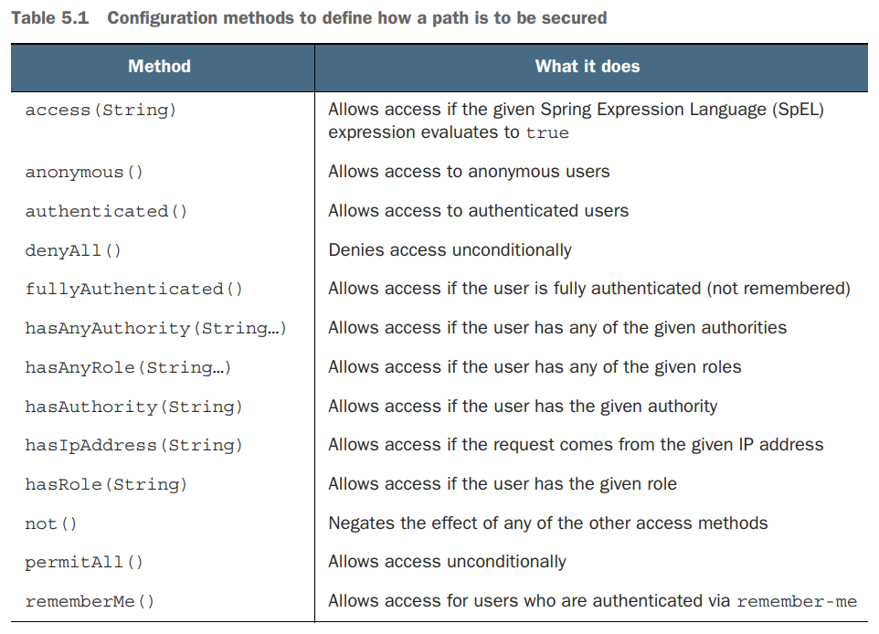
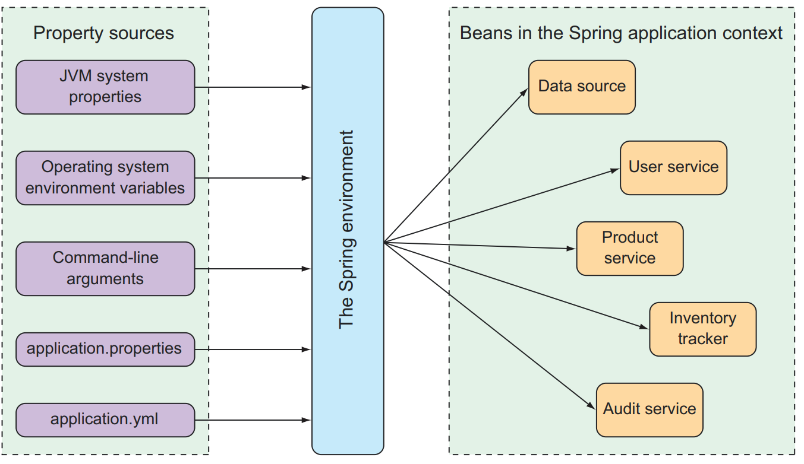
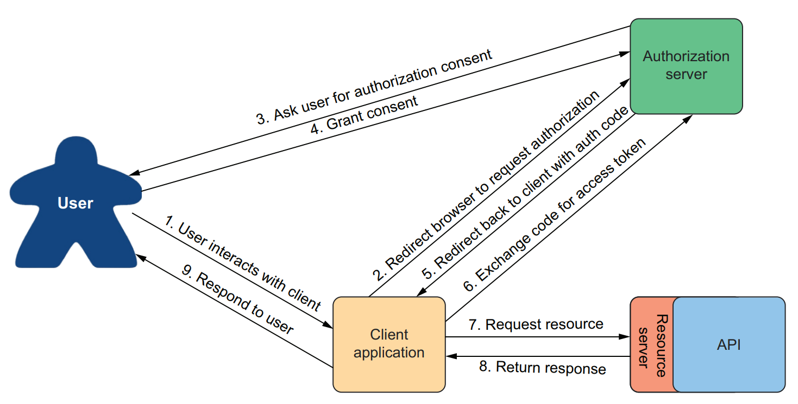
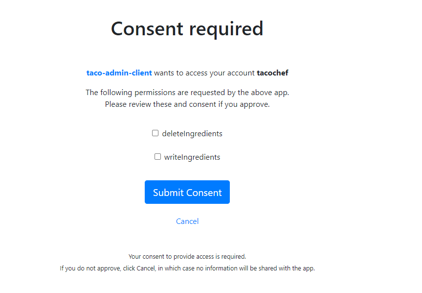
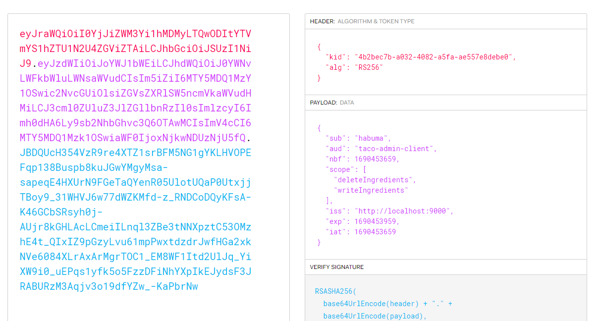
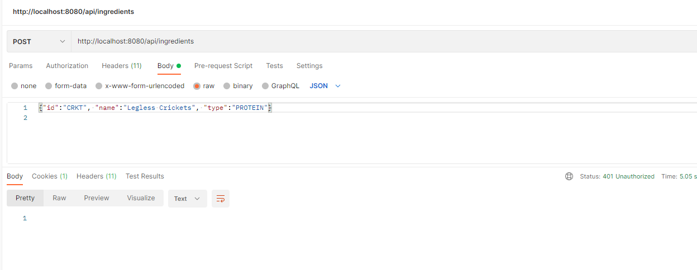
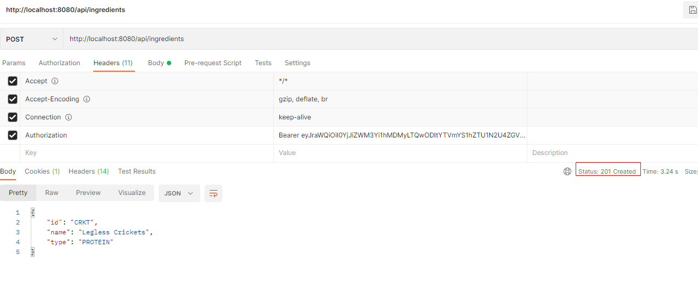
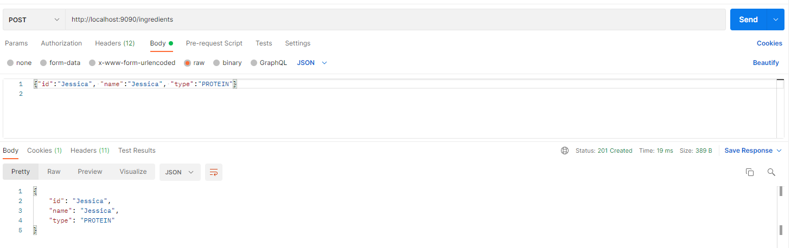
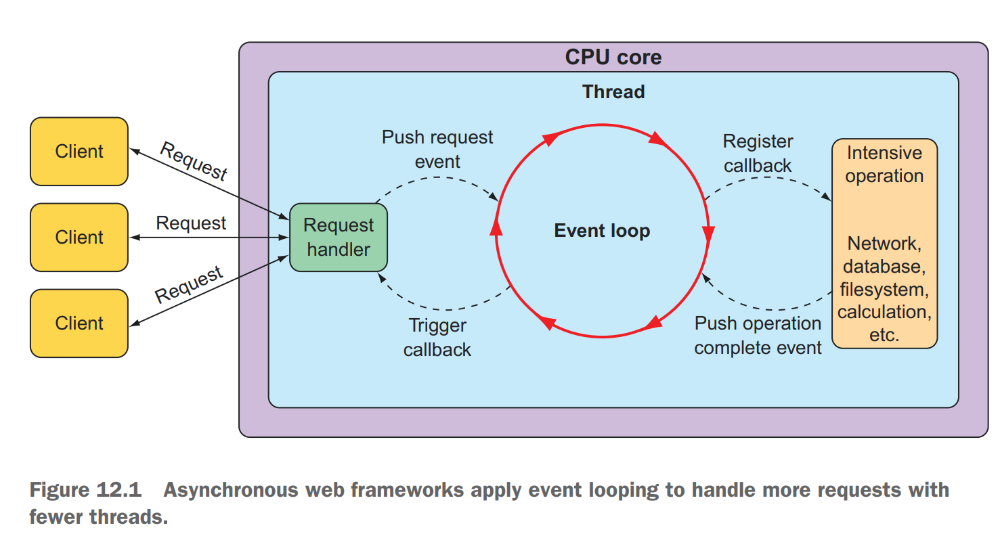

# Getting started with Spring
## 核心概念
- 容器 Container spring上下文
- 依赖注入DI
- 自动配置： autowiring：自动为component注入依赖的bean， component scan：自动扫描发现并创建bean
## 创建spring 应用
- spring initializer： spring initializer是一个基于浏览器的web应用，同时提供了rest api，可以创建spring项目
## Spring Tool Suite
- 提供mvn参数
- 选择依赖模块
    - spring boot dev tools
    - thymlleaf
    - spring web
- 工程结构
    - mvnw和mvnw.cmd：Maven wrapper脚本，可以在未安装maven的情况下使用这些脚本对项目进行构建
    - pom.xml
        - Spring Boot starter dependency：spring-boot-starter-thymeleaf， spring-boot-starter-web， spring-boot-starter-test
        - spring-boot-devtools
        - Spring Boot plugin： spring-boot-maven-plugin
            - 提供了一个maven goal，支持使用maven运行application
            - 所以依赖的lib打包时都会被包含在可执行的jar包内
            - 打包时会创建一个manifest文件，指定TacoCloudApplication为main class
    - Application.java： spring boot main class
    - application.properties
    - static：保存静态资源
    - templates：用于页面渲染的template文件
    - ApplicationTests.java
- @SpringBootApplication注解
    - @SpringBootConfiguration：可以在类中创建bean
    - @EnableAutoConfiguration：spring boot会自动创建认为需要的组件
    - @ComponentScan：扫描有@Component, @Controller, @Service注解的类，自动创建实例，并将实例作为组件注册到spring application context中
- main 方法
    - SpringApplication.run的方法有两个参数：第一个参数为configuration class，该类中可以包含一些以@Bean作为annotataion的创建bean的方法，启动时会将这些bean载入，第二个参数为命令行参数
    - configuration class可以为当前的bootstrap class，也可以为其他类，一般典型的用法是传入当前的当前的bootstrap class
- 启动
    -  ./mvnw package, java -jar target/taco-cloud-0.0.1-SNAPSHOT.jar
    -  ./mvnw spring-boot:run
- 测试
    -  ./mvnw test

## 处理web请求
- Spring MVC是spring的强大的webframework，它的核心是controller，controller用于处理request和response
- @GetMapping注解返回的是view的名字
- view的template的路径默认以/templates为开头，以.html为结尾
-  @{…}表示context-relative，相对路径
-  @WebMvcTest

## Spring Boot DevTools
- 代码更新时自动重启应用
    - DevTools启用时，应用加载时使用了两个class loader，一个用于加载应用代码，一个用于加载依赖包的代码
    - 应用代码更新时，DevTools会reload加载应用代码的class loader，并重启应用，这样可以使重启更快
    - 但是当依赖包发生变化时，必须手动重启
- 自动禁用template缓存
    - 仍需要手动刷新浏览器获取最新内容
- 静态资源变化时自动刷新浏览器
    - 启用了 LiveReload server，如果浏览器安装了 LiveReload server插件，则无需手动刷新浏览器，插件会进行自动刷新
    - https://chrome.google.com/webstore/detail/live-reload/jcejoncdonagmfohjcdgohnmecaipidc?hl=en-US
- 使用H2数据库时，内置H2控制台
    - http://localhost:8080/h2-console

## spring auto configuration做了什么
- 检测依赖的包，并自动创建需要的bean
- 创建Spring MVC需要的bean
- 创建Thymeleaf view resolver用于将Thymeleaf templates渲染为Spring MVC views
- 配置内建的tomcat server

## spring的核心framework
- spring boot
- spring data
- spring security
- Spring Integration and Spring Batch
- Spring Cloud

# Developing web applications
## @SessionAttributes
- 这个注解只能标注在类上，用于在多个请求之间传递参数，类似于Session的Attribute。但不完全一样：一般来说@SessionAttributes设置的参数只用于暂时的传递，而不是长期的保存，长期保存的数据还是要放到Session中
- 当用@SessionAttributes标注的Controller向其模型Model添加属性时，将根据该注解指定的名称/类型检查这些属性，若匹配上了就顺带也会放进Session里。匹配上的将一直放在Sesson中，直到你调用了SessionStatus.setComplete()方法就消失了
- SessionAttributesHandler, 见名之意，它是@SessionAttributes处理器，也就是解析这个注解的核心。管理通过@SessionAttributes标注了的特定会话属性，存储最终是委托了SessionAttributeStore来实现
- RequestMappingHandlerAdapter中getModelFactory时会为每个controller创建一个SessionAttributesHandler
- ModelFactory
    - Spring MVC对@SessionAttributes的处理操作入口，是在ModelFactory.initModel()方法里会对@SessionAttributes的注解进行解析、处理，然后方法完成之后也会对它进行属性同步。
    - ModelFactory是用来维护Model的，具体包含两个功能：
        - 处理器执行前，初始化Model
        - 处理器执行后，将Model中相应的参数同步更新到SessionAttributes中（不是全量，而是符合条件的那些）
    - ModelFactory协助在控制器方法调用之前初始化Model模型，并在调用之后对其进行更新。
        - 初始化时，通过调用方法上标注有@ModelAttribute的方法，使用临时存储在会话中的属性填充模型。
        - 在更新时，模型属性与会话同步，如果缺少，还将添加BindingResult属性。

## @ModelAttribute
- 将方法参数/方法返回值绑定到web view的Model里面。只支持@RequestMapping这种类型的控制器。它既可以标注在方法入参上，也可以标注在方法（返回值）上
    - ModelAttributeMethodProcessor implements HandlerMethodArgumentResolver, HandlerMethodReturnValueHandler
    - 从命名上看它是个Processor，所以根据经验它既能处理入参，也能处理方法的返回值：HandlerMethodArgumentResolver + HandlerMethodReturnValueHandler。解析@ModelAttribute注解标注的方法参数，并处理@ModelAttribute标注的方法返回值。
- @ModelAttribute标注在单独的方法上（木有@RequestMapping注解），它可以在每个控制器方法调用之前，创建出一个ModelFactory从而管理Model数据
    - RequestMappingHandlerAdapter：每次请求过来它都会创建一个ModelFactory，从而收集到全局的（来自@ControllerAdvice）+ 本Controller控制器上的所有的标注有@ModelAttribute注解的方法们
    - ModelFactory.invokeModelAttributeMethods：执行RequestMappingHandlerAdapter找到的所有的标注有@ModelAttribute注解的方法，并且是顺序执行 
- @ModelAttribute这个注解的作用，主要分为如下三个方面：
    - 绑定请求参数到命令对象（入参对象）：放在控制器方法的入参上时，用于将多个请求参数绑定到一个命令对象，从而简化绑定流程，而且自动暴露为模型数据用于视图页面展示时使用；
    - 暴露表单引用对象为模型数据：放在处理器的一般方法（非功能处理方法，也就是没有@RequestMapping标注的方法）上时，是为表单准备要展示的表单引用数据对象：如注册时需要选择的所在城市等静态信息。它在执行功能处理方法（@RequestMapping 注解的方法）之前，自动添加到模型对象中，用于视图页面展示时使用；
    - 暴露@RequestMapping方法返回值为模型数据：放在功能处理方法的返回值上时，是暴露功能处理方法的返回值为模型数据，用于视图页面展示时使用。

## spring-boot-starter-validation
- pom添加依赖
```
<dependency>
        <groupId>org.springframework.boot</groupId>
        <artifactId>spring-boot-starter-validation</artifactId>
</dependency>
```
- data model添加验证注解
```
package com.example.tacos.model;

import java.util.ArrayList;
import java.util.List;

import org.hibernate.validator.constraints.CreditCardNumber;

import jakarta.validation.constraints.Digits;
import jakarta.validation.constraints.NotBlank;
import jakarta.validation.constraints.Pattern;
import lombok.Data;

@Data
public class TacoOrder {
    @NotBlank(message = "Delivery name is required")
    private String deliveryName;
    @NotBlank(message = "Street is required")
    private String deliveryStreet;
    @NotBlank(message = "City is required")
    private String deliveryCity;
    @NotBlank(message = "State is required")
    private String deliveryState;
    @NotBlank(message = "Zip code is required")
    private String deliveryZip;
    @CreditCardNumber(message = "Not a valid credit card number")
    private String ccNumber;
    @Pattern(regexp = "^(0[1-9]|1[0-2])([\\/])([2-9][0-9])$", message = "Must be formatted MM/YY")
    private String ccExpiration;
    @Digits(integer = 3, fraction = 0, message = "Invalid CVV")
    private String ccCVV;
    private List<Taco> tacos = new ArrayList<>();

    public void addTaco(Taco taco) {
        this.tacos.add(taco);
    }
}
```
- html添加error message
```
<!DOCTYPE html>
<html xmlns="http:/ /www.w3.org/1999/xhtml" xmlns:th="http:/ /www.thymeleaf.org">

<head>
    <title>Taco Cloud</title>
    <link rel="stylesheet" th:href="@{/styles.css}" />
</head>

<body>
    <form method="POST" th:action="@{/orders}" th:object="${tacoOrder}">
        <h1>Order your taco creations!</h1>
        
        <h3>Your tacos in this order:</h3>
        <a th:href="@{/design}" id="another">Design another taco</a><br />
        <ul>
            <li th:each="taco : ${tacoOrder.tacos}">
                <span th:text="${taco.name}">taco name</span>
            </li>
        </ul>
        <h3>Deliver my taco masterpieces to...</h3>
        <label for="deliveryName">Name: </label>
        <input type="text" th:field="*{deliveryName}" />
        <span class="validationError" th:if="${#fields.hasErrors('deliveryName')}" th:errors="*{deliveryName}">Error</span>
        <br />
        <label for="deliveryStreet">Street address: </label>
        <input type="text" th:field="*{deliveryStreet}" />
        <span class="validationError" th:if="${#fields.hasErrors('deliveryStreet')}" th:errors="*{deliveryStreet}">Error</span>
        <br />
        <label for="deliveryCity">City: </label>
        <input type="text" th:field="*{deliveryCity}" />
        <span class="validationError" th:if="${#fields.hasErrors('deliveryCity')}" th:errors="*{deliveryCity}">Error</span>
        <br />
        <label for="deliveryState">State: </label>
        <input type="text" th:field="*{deliveryState}" />
        <span class="validationError" th:if="${#fields.hasErrors('deliveryState')}" th:errors="*{deliveryState}">Error</span>
        <br />
        <label for="deliveryZip">Zip code: </label>
        <input type="text" th:field="*{deliveryZip}" />
        <span class="validationError" th:if="${#fields.hasErrors('deliveryZip')}" th:errors="*{deliveryZip}">Error</span>
        <br />
        <h3>Here's how I'll pay...</h3>
        <label for="ccNumber">Credit Card #: </label>
        <input type="text" th:field="*{ccNumber}" />
        <span class="validationError" th:if="${#fields.hasErrors('ccNumber')}" th:errors="*{ccNumber}">Error</span>
        <br />
        <label for="ccExpiration">Expiration: </label>
        <input type="text" th:field="*{ccExpiration}" />
        <span class="validationError" th:if="${#fields.hasErrors('ccExpiration')}" th:errors="*{ccExpiration}">Error</span>
        <br />
        <label for="ccCVV">CVV: </label>
        <input type="text" th:field="*{ccCVV}" />
        <span class="validationError" th:if="${#fields.hasErrors('ccCVV')}" th:errors="*{ccCVV}">Error</span>
        <br />
        <input type="submit" value="Submit Order" />
    </form>
</body>

</html>
```

## WebMvcConfigurer
如果一个controller足够简单，不需要model，不需要处理input，只是返回一个view，则可以使用WebMvcConfigurer来代替
```
import org.springframework.context.annotation.Configuration;
import org.springframework.web.servlet.config.annotation.ViewControllerRegistry;
import org.springframework.web.servlet.config.annotation.WebMvcConfigurer;

@Configuration
public class WebConfig implements WebMvcConfigurer {
	@Override
	public void addViewControllers(ViewControllerRegistry registry) {
		registry.addViewController("/").setViewName("home");
	}
}
```

# Working with data
## h2 console
- http://localhost:8080/h2-console
- jdbc:h2:mem:tacocloud
## jdbc
- 当只有一个构造器方法时，Spring自动通过该构造函数的参数装配依赖项
- 如果有多个构造器方法，想要使用哪个方法装配依赖项，则需要在对应的构造器方法上加@Autowired

## schema.sql, data.sql
- 如果在根目录下有一个schema.sql文件，则在spring boot项目启动时会执行这个文件的sql
- 如果在根目录下有一个data.sql文件，则在spring boot项目启动时会执行这个文件的sql

## Reading and writing data with JDBC
- spring-boot-starter-jdbc
- org.springframework.jdbc.core.JdbcTemplate
- 需要自己实现dao层与数据库交互的代码，代码中只需关心sql语句，无需关心sql连接的建立和释放

## Working with Spring Data JDBC
- spring-boot-starter-data-jdbc
- org.springframework.data.repository.Repository
- org.springframework.data.repository.CrudRepository
- 无需实现dao层代码，只需要定义接口，接口extend Repository或者CrudRepository， spring data jdbc会自动生成代码实现
- 注解
    - org.springframework.data.relational.core.mapping.Table
    - org.springframework.data.annotation.Id;
    - org.springframework.data.relational.core.mapping.Column

## Persisting data with Spring Data JPA
- spring-boot-starter-data-jpa
- org.springframework.data.repository.Repository
- org.springframework.data.repository.CrudRepository
- 无需实现dao层代码，只需要定义接口，接口extend Repository或者CrudRepository， spring data jdbc会自动生成代码实现
- 注解
    - jakarta.persistence.Entity;
    - jakarta.persistence.GeneratedValue;
    - jakarta.persistence.GenerationType;
    - jakarta.persistence.Id;
    - jakarta.persistence.ManyToMany
    - jakarta.persistence.OneToMany
- 配置
    - spring.jpa.generate-ddl：Whether to initialize the schema on startup
    - spring.jpa.hibernate.ddl-auto：DDL mode. This is actually a shortcut for the "hibernate.hbm2ddl.auto" property. Defaults to "create-drop" when using an embedded database and no schema manager was detected. Otherwise, defaults to "none".


# Working with nonrelational data
## Working with Cassandra repositories
- spring-boot-starter-data-cassandra
- 注解
    - org.springframework.data.cassandra.core.mapping.PrimaryKey;
    - org.springframework.data.cassandra.core.mapping.Table;
    - org.springframework.data.cassandra.core.cql.Ordering;
    - org.springframework.data.cassandra.core.cql.PrimaryKeyType;
    - org.springframework.data.cassandra.core.mapping.Column;
    - org.springframework.data.cassandra.core.mapping.UserDefinedType
## Writing MongoDB repositories
- spring-boot-starter-data-mongodb
-  注解
    - org.springframework.data.annotation.Id;
    - org.springframework.data.mongodb.core.mapping.Document;

# Securing Spring
## Enabling Spring Security
- pom中添加spring-boot-starter-security依赖
- spring-boot-starter-security提供了一个默认的登录页面，默认username为：user，每次项目启动时会生成一个随机的uuid作为密码
    - Using generated security password: 2b94e0bd-0380-4293-842d-7d3dffca0c8c
- UsernamePasswordAuthenticationFilter会对请求进行验证，验证通过之后会生成一个sessionId，写入cookie中

## password encoder
- BCryptPasswordEncoder—Applies bcrypt strong hashing encryption
- NoOpPasswordEncoder—Applies no encoding
- Pbkdf2PasswordEncoder—Applies PBKDF2 encryption
- SCryptPasswordEncoder—Applies Scrypt hashing encryption
- StandardPasswordEncoder—Applies SHA-256 hashing encryption
- 数据库中存储的password是encode之后的，数据库的password永远不会被decode，需要验证时会将用户输入的密码进行encode之后与数据库存储的进行比较。由PasswordEncoder的matches() 方法实现

## 配置user store
- 需要声明一个UserDetailsService类型的bean
- Spring Security提供了几种UserDetailsService的实现
    - An in-memory user store
    - A JDBC user store
    - An LDAP user store

### in-memory user store

```
    @Bean
	public UserDetailsService userDetailsService(PasswordEncoder encoder) {
		List<UserDetails> usersList = new ArrayList<>();
		usersList.add(
				new User("buzz", encoder.encode("password"), Arrays.asList(new SimpleGrantedAuthority("ROLE_USER"))));
		usersList.add(
				new User("woody", encoder.encode("password"), Arrays.asList(new SimpleGrantedAuthority("ROLE_USER"))));
		return new InMemoryUserDetailsManager(usersList);
	}
```

###  Customizing user authentication
- Defining a user entity
- Create interface: UserRepository extends CrudRepository<User, Long>, no need to implement, define one methodin interface: User findByUsername(String username);
- Create a UserDetailsService
```
@Bean
public UserDetailsService userDetailsService(UserRepository userRepo) {
 return username -> {
 User user = userRepo.findByUsername(username);
 if (user != null) return user;
 throw new UsernameNotFoundException("User '" + username + "' not found");
 };
}
```
- Create user Registration page

## Securing web requests
- HttpSecurity充当构建器,用于配置如何在 Web 级别处理安全性
- HttpSecurity维护了一个过滤器的列表，这个过滤器的列表最终放入了DefaultSecurityFilterChain这个过滤器链中
- HttpSecurity最终提供了很多的配置，然而所有的配置也都是为了处理维护我们的过滤器列表
- 用于配置某个路径的安全策略

- HttpSecurity方法说明
    - openidLogin()	用于基于 OpenId 的验证
    - headers()	将安全标头添加到响应
    - cors()	配置跨域资源共享（ CORS ）
    - sessionManagement()	允许配置会话管理
    - portMapper()	允许配置一个PortMapper(HttpSecurity#(getSharedObject(class)))，其他提供SecurityConfigurer的对象使用 PortMapper 从 HTTP 重定向到 HTTPS 或者从 HTTPS 重定向到 HTTP。默认情况下，Spring Security使用一个PortMapperImpl映射 HTTP 端口8080到 HTTPS 端口8443，HTTP 端口80到 HTTPS 端口443
    - jee()	配置基于容器的预认证。 在这种情况下，认证由Servlet容器管理
    - x509()	配置基于x509的认证
    - rememberMe	允许配置“记住我”的验证
    - authorizeRequests()	允许基于使用HttpServletRequest限制访问
    - requestCache()	允许配置请求缓存
    - exceptionHandling()	允许配置错误处理
    - securityContext()	在HttpServletRequests之间的SecurityContextHolder上设置SecurityContext的管理。 当使用WebSecurityConfigurerAdapter时，这将自动应用
    - servletApi()	将HttpServletRequest方法与在其上找到的值集成到SecurityContext中。 当使用WebSecurityConfigurerAdapter时，这将自动应用
    - csrf()	添加 CSRF 支持，使用WebSecurityConfigurerAdapter时，默认启用
    - logout()	添加退出登录支持。当使用WebSecurityConfigurerAdapter时，这将自动应用。默认情况是，访问URL”/ logout”，使HTTP Session无效来清除用户，清除已配置的任何#rememberMe()身份验证，清除SecurityContextHolder，然后重定向到”/login?success”
    - anonymous()	允许配置匿名用户的表示方法。 当与WebSecurityConfigurerAdapter结合使用时，这将自动应用。 默认情况下，匿名用户将使用org.springframework.security.authentication.AnonymousAuthenticationToken表示，并包含角色 “ROLE_ANONYMOUS”
    - formLogin()	指定支持基于表单的身份验证。如果未指定FormLoginConfigurer#loginPage(String)，则将生成默认登录页面
    - oauth2Login()	根据外部OAuth 2.0或OpenID Connect 1.0提供程序配置身份验证
    - requiresChannel()	配置通道安全。为了使该配置有用，必须提供至少一个到所需信道的映射
    - httpBasic()	配置 Http Basic 验证
    - addFilterAt()	在指定的Filter类的位置添加过滤器
- 使用
    - authorizeHttpRequests 用于配置每个路径需要使用什么安全策略
    - headers, 将安全标头添加到响应， 由于h2-console是以iframe的形式嵌入在页面上的，所以这里必须配置frameOptions，headers.frameOptions().sameOrigin() 和headers.frameOptions().disable()都可以，否则的话h2-console将无法正常显示
    - formLogin： 用于配置登录页面，这里不作额外配置就是使用默认登录页面，如果不加formLogin，将不会使用任何登录页面，默认登录页面也没有
```
	@Bean
	SecurityFilterChain filterChain(HttpSecurity http) throws Exception {
		return http
				.authorizeHttpRequests(auth -> auth.requestMatchers(AntPathRequestMatcher.antMatcher("/h2-console/**"))
						.permitAll().requestMatchers("/design", "/orders").hasRole("USER").requestMatchers("/", "/**")
						.permitAll())
				.headers(headers -> headers.frameOptions().sameOrigin())
				.csrf(csrf -> csrf.ignoringRequestMatchers(AntPathRequestMatcher.antMatcher("/h2-console/**")))
				.formLogin().and().build();
	}
```
## Creating a custom login page
    - cofig SecurityFilterChain
    ```
        @Bean
	SecurityFilterChain filterChain(HttpSecurity http) throws Exception {
		return http
				.authorizeHttpRequests(auth -> auth.requestMatchers(AntPathRequestMatcher.antMatcher("/h2-console/**"))
						.permitAll().requestMatchers("/design", "/orders", "/current").hasRole("USER")
						.requestMatchers("/", "/**").permitAll())
				.headers(headers -> headers.frameOptions().sameOrigin())
				.csrf(csrf -> csrf.ignoringRequestMatchers(AntPathRequestMatcher.antMatcher("/h2-console/**")))
				.formLogin().loginPage("/login").loginProcessingUrl("/authenticate").usernameParameter("username")
				.passwordParameter("password").defaultSuccessUrl("/design").and().logout()
				.logoutSuccessUrl("/login").and().build();
	}
    ```
    - prepare login page html
    ```
    <!DOCTYPE html>
    <html xmlns="http:/ /www.w3.org/1999/xhtml"
    xmlns:th="http:/ /www.thymeleaf.org">
    <head>
    <title>Taco Cloud</title>
    </head>
    <body>
    <h1>Login</h1>
    
    <div th:if="${error}">
    Unable to login. Check your username and password.
    </div>
    <p>New here? Click
    <a th:href="@{/register}">here</a> to register.</p>
    <form method="POST" th:action="@{/authenticate}" id="loginForm">
    <label for="username">Username: </label>
    <input type="text" name="username" id="username" /><br/>
    <label for="password">Password: </label>
    <input type="password" name="password" id="password" /><br/>
    <input type="submit" value="Login"/>
    </form>
    </body>
    </html>
    ```
    - sets up the login page view controller 
    ```
    @Configuration
    public class WebConfig implements WebMvcConfigurer {
        @Override
        public void addViewControllers(ViewControllerRegistry registry) {
            registry.addViewController("/login");
        }
    }
    ```

## HttpSecurity：
- 配置filter
    - cors()： CorsConfigurer, CorsFilter
    - csrf()： CsrfConfigurer, CsrfFilter
    - exceptionHandling(): ExceptionHandlingConfigurer, ExceptionTranslationFilter
    - formLogin(): FromLoginConfigure: UsernamePasswordAuthenticationFilter
    - headers(): HeadersConfigurer： HeaderWriterFilter
    - httpBasic(): HttpBasicConfigurer: BasicAuthenticationFilter
    - jee(): JeeConfigurer, J2eePreAuthenticatedProcessingFilter
    - logout(): LogoutConfigurer, LogoutFilter
    - oauth2Client(): OAuth2ClientConfigurer, OAuth2AuthorizationRequestRedirectFilter, OAuth2AuthorizationCodeGrantFilter
    - oauth2Login(): OAuth2LoginConfigurer, OAuth2AuthorizationRequestRedirectFilter, OAuth2LoginAuthenticationFilter
    - oauth2ResourceServer(): OAuth2ResourceServerConfigurer, BearerTokenAuthenticationFilter
    - passwordManagement: PasswordManagementConfigurer, RequestMatcherRedirectFilter
    - portMapper: PortMapperConfigurer, 
    - rememberMe()： RememberMeConfigurer, RememberMeAuthenticationFilter， DefaultLoginPageGeneratingFilter
    - requestCache(): RequestCacheConfigurer, RequestCacheAwareFilter
    - requiresChannel():ChannelSecurityConfigurer, ChannelProcessingFilter
    - saml2Login: Saml2LoginConfigurer, Saml2WebSsoAuthenticationRequestFilter
    - saml2Logout: Saml2LogoutConfigurer, Saml2LogoutRequestFilter, Saml2LogoutResponseFilter, LogoutFilter
    - securityContext():  SecurityContextConfigurer
        - if requireExplicitSave is true： SecurityContextHolderFilter, 
        - else SecurityContextPersistenceFilter, ForceEagerSessionCreationFilter
    - servletApi(): ServletApiConfigurer, SecurityContextHolderAwareRequestFilter
    - sessionManagement(): SessionManagementConfigurer, SessionManagementFilter, ConcurrentSessionFilter， DisableEncodeUrlFilter， ForceEagerSessionCreationFilter
    - x509(): X509Configurer, X509AuthenticationFilter
- HttpSecurity是如何进行初始化的
    - HttpSecurityConfiguration
    ```
    @Bean(HTTPSECURITY_BEAN_NAME)
	@Scope("prototype")
	HttpSecurity httpSecurity() throws Exception {
		LazyPasswordEncoder passwordEncoder = new LazyPasswordEncoder(this.context);
		AuthenticationManagerBuilder authenticationBuilder = new DefaultPasswordEncoderAuthenticationManagerBuilder(
				this.objectPostProcessor, passwordEncoder);
		authenticationBuilder.parentAuthenticationManager(authenticationManager());
		authenticationBuilder.authenticationEventPublisher(getAuthenticationEventPublisher());
		HttpSecurity http = new HttpSecurity(this.objectPostProcessor, authenticationBuilder, createSharedObjects());
		WebAsyncManagerIntegrationFilter webAsyncManagerIntegrationFilter = new WebAsyncManagerIntegrationFilter();
		webAsyncManagerIntegrationFilter.setSecurityContextHolderStrategy(this.securityContextHolderStrategy);
		// @formatter:off
		http
			.csrf(withDefaults())
			.addFilter(webAsyncManagerIntegrationFilter)
			.exceptionHandling(withDefaults())
			.headers(withDefaults())
			.sessionManagement(withDefaults())
			.securityContext(withDefaults())
			.requestCache(withDefaults())
			.anonymous(withDefaults())
			.servletApi(withDefaults())
			.apply(new DefaultLoginPageConfigurer<>());
		http.logout(withDefaults());
		// @formatter:on
		applyDefaultConfigurers(http);  // no defaultHttpConfigurers
		return http;
	}```

    - 如果配置了SecurityFilterChain, 作为会使用该bean中的http配置，最终通过的build方法开始对http进行配置
    ```
    SecurityFilterChain filterChain(HttpSecurity http) throws Exception {
		return http
				.authorizeHttpRequests(auth -> auth.requestMatchers(AntPathRequestMatcher.antMatcher("/h2-console/**"))
						.permitAll().requestMatchers("/design", "/orders", "/current").hasRole("USER")
						.requestMatchers("/", "/**").permitAll())
				.headers(headers -> headers.frameOptions().sameOrigin()).csrf().disable().formLogin()
				.loginPage("/login").loginProcessingUrl("/authenticate").usernameParameter("username")
				.passwordParameter("password").defaultSuccessUrl("/design").and().logout().logoutSuccessUrl("/login")
				.and().build();
	}

    ```
    - HttpSecurity 的configures和对应的Filter
        - WebAsyncManagerIntegrationFilter
        - ExceptionHandlingConfigurer: ExceptionTranslationFilter
        - HeadersConfigurer： HeaderWriterFilter
        - SessionManagementConfigurer： DisableEncodeUrlFilter
        - SecurityContextConfigurer： SecurityContextHolderFilter
        - RequestCacheConfigurer:  RequestCacheAwareFilter
        - AnonymousConfigurer:  AnonymousAuthenticationFilter
        - ServletApiConfigurer: SecurityContextHolderAwareRequestFilter
        - DefaultLoginPageConfigurer: DefaultLoginPageGeneratingFilter, (if LogoutConfigurer exist), add DefaultLogoutPageGeneratingFilter
        - LogoutConfigurer: LogoutFilter
        - AuthorizeHttpRequestsConfigurer: AuthorizationFilter
        - FromLoginConfigure: UsernamePasswordAuthenticationFilter
    - 如果没有配置SecurityFilterChain， 则会默认使用SpringBootWebSecurityConfiguration中的SecurityFilterChain对http进行配置
    ```
    @Configuration(proxyBeanMethods = false)
    @ConditionalOnWebApplication(type = Type.SERVLET)
    class SpringBootWebSecurityConfiguration {

        /**
        * The default configuration for web security. It relies on Spring Security's
        * content-negotiation strategy to determine what sort of authentication to use. If
        * the user specifies their own {@link SecurityFilterChain} bean, this will back-off
        * completely and the users should specify all the bits that they want to configure as
        * part of the custom security configuration.
        */
        @Configuration(proxyBeanMethods = false)
        @ConditionalOnDefaultWebSecurity
        static class SecurityFilterChainConfiguration {

            @Bean
            @Order(SecurityProperties.BASIC_AUTH_ORDER)
            SecurityFilterChain defaultSecurityFilterChain(HttpSecurity http) throws Exception {
                http.authorizeHttpRequests().anyRequest().authenticated();
                http.formLogin();
                http.httpBasic();
                return http.build();
            }

        }

        /**
        * Adds the {@link EnableWebSecurity @EnableWebSecurity} annotation if Spring Security
        * is on the classpath. This will make sure that the annotation is present with
        * default security auto-configuration and also if the user adds custom security and
        * forgets to add the annotation. If {@link EnableWebSecurity @EnableWebSecurity} has
        * already been added or if a bean with name
        * {@value BeanIds#SPRING_SECURITY_FILTER_CHAIN} has been configured by the user, this
        * will back-off.
        */
        @Configuration(proxyBeanMethods = false)
        @ConditionalOnMissingBean(name = BeanIds.SPRING_SECURITY_FILTER_CHAIN)
        @ConditionalOnClass(EnableWebSecurity.class)
        @EnableWebSecurity
        static class WebSecurityEnablerConfiguration {

        }

    }
    ```
    HttpSecurity 的configures和对应的Filter
        - WebAsyncManagerIntegrationFilter
        - CsrfConfigurer:CsrfFilter
        - ExceptionHandlingConfigurer: ExceptionTranslationFilter
        - HeadersConfigurer： HeaderWriterFilter
        - SessionManagementConfigurer： DisableEncodeUrlFilter
        - SecurityContextConfigurer： SecurityContextHolderFilter
        - RequestCacheConfigurer:  RequestCacheAwareFilter
        - AnonymousConfigurer:  AnonymousAuthenticationFilter
        - ServletApiConfigurer: SecurityContextHolderAwareRequestFilter
        - DefaultLoginPageConfigurer: DefaultLoginPageGeneratingFilter, (if LogoutConfigurer exist), add DefaultLogoutPageGeneratingFilter
        - LogoutConfigurer: LogoutFilter
        - AuthorizeHttpRequestsConfigurer: AuthorizationFilter
        - FromLoginConfigure: UsernamePasswordAuthenticationFilter
        - HttpBasicConfigurer: BasicAuthenticationFilter

- session创建流程: 第一次访问
    - org.apache.catalina.util.SessionIdGeneratorBase.generateSessionId()
    - org.apache.catalina.session.ManagerBase.createSession(String)
    - org.apache.catalina.connector.Request.doGetSession(boolean)
    - org.apache.catalina.connector.Request.getSession(boolean)
    - org.springframework.security.web.csrf.HttpSessionCsrfTokenRepository.loadToken(HttpServletRequest)
    - org.springframework.security.web.csrf.CsrfFilter.doFilterInternal(HttpServletRequest, HttpServletResponse, FilterChain)


- 登录流程： UsernamePasswordAuthenticationFilter
    - HttpSecurity配置中的loginProcessingUrl会经过该filter，其他请求不会经过该filter，用户名密码对应的request paramter的名字由usernameParameter和passwordParameter进行配置
    ```
    @Bean
        SecurityFilterChain filterChain(HttpSecurity http) throws Exception {
            return http
                    .authorizeHttpRequests(auth -> auth.requestMatchers(AntPathRequestMatcher.antMatcher("/h2-console/**"))
                            .permitAll().requestMatchers("/design", "/orders", "/current").hasRole("USER")
                            .requestMatchers("/", "/**").permitAll())
                    .headers(headers -> headers.frameOptions().sameOrigin()).csrf().disable().formLogin()
                    .loginPage("/login").loginProcessingUrl("/authenticate").usernameParameter("username")
                    .passwordParameter("password").defaultSuccessUrl("/design").and().logout().logoutSuccessUrl("/login")
                    .and().build();
        }
    ```
    - UsernamePasswordAuthenticationFilter  extends AbstractAuthenticationProcessingFilter 
    - 从request中获取用户名密码进行验证，验证成功
    - CompositeSessionAuthenticationStrategy.onAuthentication(authenticationResult, request, response)
        - ChangeSessionIdAuthenticationStrategy.onAuthentication
            - sesssion不存在，则无需fix
            - session存在且sessionId有效，则需要创建新的sessionId来替换老的sessionId，并发布 SessionFixationProtectionEvent, ```
            ```
            AbstractSessionFixationProtectionStrategy.onSessionChange(String, HttpSession, Authentication)
            AbstractAuthenticationProcessingFilter.successfulAuthentication
            ```
        - build SecurityContext， 将验证结果设置到SecurityContext
        - 将SecurityContext设置到SecurityContextHolder中, ThreadLocalSecurityContextHolderStrategy.setContext
        - 将SecurityContext进行保存，默认是保存到session中attribute中，attribute key为SPRING_SECURITY_CONTEXT, DelegatingSecurityContextRepository.saveContext->HttpSessionSecurityContextRepository.saveContext

- SecurityContext设置流程：SecurityContextHolderFilter
    - 加载 SecurityContext： DelegatingSecurityContextRepository.loadDeferredContext
    - HttpSessionSecurityContextRepository.loadDeferredContext, readSecurityContextFromSession
    - RequestAttributeSecurityContextRepository.loadDeferredContext, 从request的attribute中获取， 默认attribute的名字为org.springframework.security.web.context.RequestAttributeSecurityContextRepository.SPRING_SECURITY_CONTEXT
    - 设置加载到的deferredSecurityContext到SecurityContextHolder：ThreadLocalSecurityContextHolderStrategy.setDeferredContext

- 验证流程： AuthorizationFilter
    - 从SecurityContext中获取Authentication验证结果，ThreadLocalSecurityContextHolderStrategy.getContext().getAuthentication()
    - 检测Authentication是否为granted，若为granted则验证通过，否则验证失败

## OAuth2
- application.yml 配置oauth2 client的相关信息
```
spring:
  datasource:
    generate-unique-name: false
    name: tacocloud
  security:
    oauth2:
      client:
        registration:
          github:
            client-id: ${client_id}   #replace this with real value
            client-secret: ${client_secret}   #replace this with real value

```
- config，添加oauth2 client的相关配置
```

    private GrantedAuthoritiesMapper userAuthoritiesMapper() {
        return (authorities) -> {
            Set<GrantedAuthority> mappedAuthorities = new HashSet<>();
            authorities.forEach(authority -> {
                mappedAuthorities.add(new SimpleGrantedAuthority("ROLE_USER"));
            });
            return mappedAuthorities;
        };
    }

    @Bean
    SecurityFilterChain filterChain(HttpSecurity http) throws Exception {
        return http
                .authorizeHttpRequests(auth -> auth.requestMatchers(AntPathRequestMatcher.antMatcher("/h2-console/**")).permitAll()
                        .requestMatchers("/design", "/orders", "/current").hasRole("USER")
                        .requestMatchers("/", "/**").permitAll())
                .headers(headers -> headers.frameOptions().sameOrigin()).csrf().disable()
                .formLogin()
                .loginPage("/login")
                .loginProcessingUrl("/authenticate")
                .usernameParameter("username")
                .passwordParameter("password")
                .defaultSuccessUrl("/design")
                .and()
                .logout()
                .logoutSuccessUrl("/login")
                .and()
                .oauth2Login()
                .loginPage("/login")
                .userInfoEndpoint(userInfo -> userInfo.userAuthoritiesMapper(this.userAuthoritiesMapper())).and()
                .build();
    }
```
- login page:添加登录链接
```
 <div>
    Login With GitHub: <a href="/oauth2/authorization/github">click here</a>
 </div>
```

## Preventing cross-site request forgery
- Spring Security 内置了 CSRF 保护。它是默认启用的，不需要显式配置它
- 只需要确保提交的所有表单都包含名为_csrf 包含 CSRF 令牌
- Spring Security 可以通过将 CSRF 令牌放置在名为 _csrf 的请求属性中来轻松实现这一点。因此，可以将 CSRF 令牌呈现在隐藏的input中，如果使用 Spring MVC 的 JSP 标签库或带有 Spring Security 方言的 Thymeleaf，甚至不需要显式地包含隐藏字段。隐藏字段将会自动添加到页面上
```
<input type="hidden" name="_csrf" th:value="${_csrf.token}"/>
```
- 在 Thymeleaf 中，只需要确保 <form> 的属性之一元素的前缀是 Thymeleaf 属性。例如，只需要在form中包含 th:action 属性，则_csrf的隐藏input就会自动渲染到页面上
```
<form method="POST" th:action="@{/login}" id="loginForm">
```
### 什么是CSRF攻击
- 假设您的银行网站提供了一个表单，允许将资金从当前登录的用户转移到另一个银行账户
```
<form method="post"
	action="/transfer">
<input type="text"
	name="amount"/>
<input type="text"
	name="routingNumber"/>
<input type="text"
	name="account"/>
<input type="submit"
	value="Transfer"/>
</form>
```
- 表单提交时，发送的请求如下
```
POST /transfer HTTP/1.1
Host: bank.example.com
Cookie: JSESSIONID=randomid
Content-Type: application/x-www-form-urlencoded

amount=100.00&routingNumber=1234&account=9876
```
- 现在假设你在你的银行网站上进行了身份验证，然后在没有注销的情况下访问了一个恶意网站。恶意网站包含一个具有以下形式的 HTML 页面：
```
<form method="post"
	action="https://bank.example.com/transfer">
<input type="hidden"
	name="amount"
	value="100.00"/>
<input type="hidden"
	name="routingNumber"
	value="evilsRoutingNumber"/>
<input type="hidden"
	name="account"
	value="evilsAccountNumber"/>
<input type="submit"
	value="Win Money!"/>
</form>
```
- 当你点击提交按钮的时候，浏览器就会给银行转账的url发送请求，发送请求时会带上银行网站的Cookie，有了这个Cookie，就可以通过银行网站的身份验证，进而成功向恶意用户的账户进行转账。

### CSRF攻击发生的前提
- 用户在浏览器上进行了身份验证（比如登录操作），且该身份验证产生的Cookie仍在有效期内
- 银行网站的Cookie没有设置SameSite Attribute，导致在任意网页向银行网站发送请求都可以携带银行网站的Cookie
- 银行网站没有验证发送请求的网站是否为银行自己的网站

### 如何避免CSRF攻击
#### CSRF Token
- 防止 CSRF 攻击的主要且最全面的方法是使用 Synchronizer Token Pattern。
- 这个解决方案是为了确保每个 HTTP 请求除了我们的会话 cookie 之外，还需要一个称为 CSRF Token的安全随机生成值出现在 HTTP 请求中
- 提交 HTTP 请求时，服务器必须查找预期的 CSRF Token并将其与 HTTP 请求中的实际 CSRF Token进行比较。如果值不匹配，则应拒绝 HTTP 请求
- 这项工作的关键是实际的 CSRF Token在浏览器发送请求时不会自动包含在HTTP 请求中。例如，在 HTTP 参数或 HTTP Header中传递实际的 CSRF Token可以防止 CSRF 攻击，但如果将CSRF Token保存在Cookie中，则 CSRF Token将不起作用，因为即便在恶意网站给银行网站发送请求，浏览器也会自动将银行网站的Cookie 包含在 HTTP 请求中。
- 引入CSRF Token之后，银行网站的页面将添加一个_csrf的隐藏input来保存回银行网站服务器返回的CSRF Token， 并在发送请求时自动将该_csrf参数包含在内。恶意站点无法读取 CSRF Token，因为同源策略可确保恶意站点无法读取银行网站服务器返回的响应，自然也就无法获取到响应中包含的CSRF Token。
```
<form method="post"
	action="/transfer">
<input type="hidden"
	name="_csrf"
	value="4bfd1575-3ad1-4d21-96c7-4ef2d9f86721"/>
<input type="text"
	name="amount"/>
<input type="text"
	name="routingNumber"/>
<input type="hidden"
	name="account"/>
<input type="submit"
	value="Transfer"/>
</form>
```
- 表单提交时，发送的请求如下, 请求的request parameter中将包含一个_csrf的参数，银行网站可以验证请求中 CSRF Token与服务器保存的 CSRF Token是否一致。恶意网站将无法为 _csrf 参数提供正确的值，当服务器将请求中的 CSRF Token与服务器保存的 CSRF Token进行比较时，验证将失败。
```
POST /transfer HTTP/1.1
Host: bank.example.com
Cookie: JSESSIONID=randomid
Content-Type: application/x-www-form-urlencoded

amount=100.00&routingNumber=1234&account=9876&_csrf=4bfd1575-3ad1-4d21-96c7-4ef2d9f86721
```

#### Cookie的SameSite Attribute
- 一种防止 CSRF 攻击的新兴方法是在 cookie 上指定 SameSite 属性
- 服务器可以在设置 cookie 时指定 SameSite 属性，以指示当请求来自外部站点时不应该携带cookie
- Spring Security 不直接控制会话 cookie 的创建，因此不提供对 SameSite 属性的支持。 Spring Session 在基于 servlet 的应用程序中提供对 SameSite 属性的支持。 Spring Framework 的 CookieWebSessionIdResolver 为基于 WebFlux 的应用程序中的 SameSite 属性提供开箱即用的支持。
- SameSite属性的可选值
	- Strict：来自同一站点的任何请求都包含 cookie。否则，cookie 不包含在 HTTP 请求中。
	- Lax：当来自同一站点或请求来自父域时发送 cookie，并且该方法是幂等的。否则，cookie 不包含在 HTTP 请求中
- 通过在我们的会话 cookie 上设置 SameSite 属性，在银行网站上给银行网站的server发送请求时，将会携带银行网站的JSESSIONID cookie。但是，在恶意网站上给银行网站的server发送请求时，将不会携带银行网站的 JSESSIONID cookie，请求中不包含session cookie信息，因此不会通过验证，由此避免了 CSRF 攻击。
- 但是使用 SameSite 属性来防止 CSRF 攻击时，有一些注意事项。
	- 将 SameSite 属性设置为 Strict 可提供更强大的防御，但在某些场景下会使用户感到困惑。假设一个用户登录了 social.example.com 的社交媒体网站。用户在 email.example.org 收到一封电子邮件，其中包含指向社交媒体网站的链接。如果用户单击该链接，他们理所当然地希望通过社交媒体网站的身份验证。但是，如果  social.example.com 的SameSite 属性为 Strict，则由于请求来自 email.example.org网站，则访问social.example.com时 不会携带social.example.com的cookie，因此用户无法通过身份验证，需要再次进行登录操作。

### 何时需要对网站进行CSRF攻击的保护
- 对可以通过浏览器处理的任何请求使用 CSRF 保护
- 对于仅供非浏览器客户端使用的服务，可以禁用 CSRF 保护，比如只供server端调用的接口

 除了支持request级别的权限验证， Spring Security还支持方法级别的权限验证
- 可以通过@EnableMethodSecurity注解来启用方法级别的验证

## Method Security
### Method Security如何工作
- Method Security通过利用Spring AOP来实现
- 注解：@PreAuthorize, @PostAuthorize, @PreFilter, @PostFilter，@Secured， JSR-250 annotations
- Method Security 的注解也可以应用在 class和 interface 上
- 工作流程 
	- Spring APO首先调用readCustomer的代理方法，在代理的其他顾问中，它调用与 @PreAuthorize 切入点匹配的 AuthorizationManagerBeforeMethodInterceptor
	- AuthorizationManagerBeforeMethodInterceptor 调用 PreAuthorizeAuthorizationManager#check
	- PreAuthorizeAuthorizationManager利用MethodSecurityExpressionHandler 来解析注解中的表达式进，利用MethodSecurityExpressionRoot 创建一个EvaluationContext ，MethodSecurityExpressionRoot 中包含了Supplier<Authentication> 和 MethodInvocation
	- interceptor利用这个EvaluationContext来检测表达式，它会从Supplier<Authentication>中读取Authentication，然后检测 authorities中是否包含permission:read
	- 如果验证通过，Spring APO会调用readCustomer方法
	- 如果验证失败，发布AuthorizationDeniedEvent，抛出AccessDeniedException，ExceptionTranslationFilter会处理AccessDeniedException，返回403
	- 当方法调用返回后，Spring APO会调用AuthorizationManagerAfterMethodInterceptor
	- AuthorizationManagerAfterMethodInterceptor调用PostAuthorizeAuthorizationManager#check进行验证
	- 如果验证通过，方法正常继续执行
	- 如果验证失败，发布AuthorizationDeniedEvent，抛出AccessDeniedException，ExceptionTranslationFilter会处理AccessDeniedException，返回403

- 如果一个方法上有多个注解，则多个注解的验证都通过后方法才会正常调用
- 同一个方法上不允许声明多个相同的注解
- 每一个注解都有自己对应的Method Interceptor
	- @PreAuthorize：AuthenticationManagerBeforeMethodInterceptor#preAuthorize, PreAuthorizeAuthorizationManager
	- @PostAuthorize：AuthenticationManagerAfterMethodInterceptor#postAuthorize, PostAuthorizeAuthorizationManager
	- @PreFilter, PreFilterAuthorizationMethodInterceptor
		- 在执行方法之前，先对方法参数进行过滤，支持array，collection，map，stream
	- @PostFilter, PostFilterAuthorizationMethodInterceptor
		- - 在执行方法之前，对方法返回值进行过滤，支持array，collection，map，stream
	- @Secured, AuthenticationManagerBeforeMethodInterceptor#secured, SecuredAuthorizationManager
		- @Secured 是用于授权调用的遗留选项。 @PreAuthorize 可以取代它，推荐使用PreAuthorize
		- @EnableMethodSecurity(securedEnabled = true)
	- For JSR-250 annotations, AuthenticationManagerBeforeMethodInterceptor#jsr250, Jsr250AuthorizationManager
		- 如果想使用 JSR-250 注释，Spring Security 也支持。 @PreAuthorize 具有更强的表达能力，因此更推荐使用PreAuthorize
		- @EnableMethodSecurity(jsr250Enabled = true)
		- 对声明了@RolesAllowed、@PermitAll 和 @DenyAll 注解的方法、类和接口进行授权
- 支持元注解
```
@Target({ ElementType.METHOD, ElementType.TYPE })
@Retention(RetentionPolicy.RUNTIME)
@PreAuthorize("hasRole('ADMIN')")
public @interface IsAdmin {}

Component
public class BankService {
	@IsAdmin
	public Account readAccount(Long id) {
        // ... is only returned if the `Account` belongs to the logged in user
	}
}
```
- 只启用特定注解
```
@Configuration
@EnableMethodSecurity(prePostEnabled = false)
class MethodSecurityConfig {
	@Bean
	@Role(BeanDefinition.ROLE_INFRASTRUCTURE)
	Advisor postAuthorize() {
		return AuthorizationManagerBeforeMethodInterceptor.postAuthorize();
	}
}
```
- 在SpEL中使用自定义bean
```
@Component("authz")
public class AuthorizationLogic {
    public boolean decide(MethodSecurityExpressionOperations operations) {
        // ... authorization logic
    }
}

@Controller
public class MyController {
    @PreAuthorize("@authz.decide(#root)")
    @GetMapping("/endpoint")
    public String endpoint() {
        // ...
    }
}
```
- 使用自定义的Authorization Manager
```
@Component
public class MyAuthorizationManager implements AuthorizationManager<MethodInvocation> {
    public AuthorizationDecision check(Supplier<Authentication> authentication, MethodInvocation invocation) {
        // ... authorization logic
    }
}
@Configuration
@EnableMethodSecurity(prePostEnabled = false)
class MethodSecurityConfig {
    @Bean
	@Role(BeanDefinition.ROLE_INFRASTRUCTURE)
	Advisor postAuthorize(MyAuthorizationManager manager) {
		return AuthorizationManagerBeforeMethodInterceptor.preAuthorize(manager);
	}

	@Bean
	@Role(BeanDefinition.ROLE_INFRASTRUCTURE)
	Advisor postAuthorize(MyAuthorizationManager manager) {
		return AuthorizationManagerAfterMethodInterceptor.postAuthorize(manager);
	}
}
```
- 使用自定义的表达式处理器
	- 使用静态方法公开 MethodSecurityExpressionHandler 以确保 Spring 在初始化 Spring Security 的方法安全 @Configuration 类之前发布它
	```
	@Bean
	static MethodSecurityExpressionHandler methodSecurityExpressionHandler(RoleHierarchy roleHierarchy) {
		DefaultMethodSecurityExpressionHandler handler = new DefaultMethodSecurityExpressionHandler();
		handler.setRoleHierarchy(roleHierarchy);
		return handler;
	}
	```
### Authorizing with AspectJ
- 使用自定义的切点来匹配方法
	- 基于 Spring AOP 构建，可以声明与注释无关的模式，类似于请求级授权。这具有集中方法级授权规则的潜在优势。
	- 例如，您可以使用发布自己的 Advisor 或使用 <protect-pointcut> 将 AOP 表达式与服务层的授权规则相匹配，如下所示：
	```
	@Bean
	@Role(BeanDefinition.ROLE_INFRASTRUCTURE)
	static Advisor protectServicePointcut() {
		JdkRegexpMethodPointcut pattern = new JdkRegexpMethodPointcut();
		pattern.setPattern("execution(* com.mycompany.*Service.*(..))");
		return new AuthorizationManagerBeforeMethodInterceptor(pattern, hasRole("USER"));
	}

	<sec:method-security>
		<protect-pointcut expression="execution(* com.mycompany.*Service.*(..))" access="hasRole('USER')"/>
	</sec:method-security>
	```
- 与 AspectJ 字节编织集成
	- 有时可以通过使用 AspectJ 将 Spring Security advice编织到 bean 的字节代码中来增强性能。
	- 设置 AspectJ 后，可以非常简单地在 @EnableMethodSecurity 注释或 <method-security> 元素中声明您正在使用 AspectJ：
	```
	@EnableMethodSecurity(mode=AdviceMode.ASPECTJ)
	```
### 顺序配置
- 如前所述，每个注释都有一个 Spring AOP 方法拦截器，并且每个注释在 Spring AOP advisor 链中都有一个位置
- @PreFilter方法拦截器的阶数是100，@PreAuthorize的阶数是200，以此类推。
- 需要注意的是，还有其他基于 AOP 的注释，例如 @EnableTransactionManagement，其顺序为 Integer.MAX_VALUE，即它们默认位于顾问链的末端
- 有时，需要在 Spring Security 之前执行其他advice。例如，如果有一个用 @Transactional 和 @PostAuthorize 注释的方法，可能希望在 @PostAuthorize 运行时事务仍处于打开状态，以便 AccessDeniedException 触发回滚。
- 要让 @EnableTransactionManagement 在方法授权建议运行之前打开事务，可以像这样设置 @EnableTransactionManagement 的顺序：
```
@EnableTransactionManagement(order = 0)
```
### Expressing Authorization with SpEL
#### 使用授权表达式字段和方法
- permitAll - 允许所有请求，无需进行验证，不会从session中读取Authentication
- denyAll - 拒绝所有请求，无需进行验证，不会从session中读取Authentication
- hasAuthority - 拥有某个权限时，才允许调用，权限判断方法就是读取Authentication的GrantedAuthority，判断GrantedAuthority是否与给定值相等
- hasRole - hasAuthority的一种缩写，会以 ROLE_ 作为prefix，用户只需要指定role，匹配时会自动加上ROLE_${role}，然后再与GrantedAuthority的值进行比较
- hasAnyAuthority - 拥有某几个权限中的任意一个，用于给出几个值，GrantedAuthority中只要有一个与给定值相等，则视为有权限
- hasAnyRole - hasAnyAuthority的一种缩写，会以 ROLE_ 作为prefix，用户只需要指定role，匹配时会自动加上ROLE_${role}，然后再与GrantedAuthority的值进行比较
- hasPermission - 调用用户自定义的PermissionEvaluator实例，来进行对象级别的权限验证

#### 使用方法参数
- Spring Security 提供了一种发现方法参数的机制，因此也可以在 SpEL 表达式中访问它们
```
@PreAuthorize("hasPermission(#c, 'write')")
public void updateContact(@P("c") Contact contact);
```
-name参数与Authentication#getName相等
```
@PreAuthorize("#n == authentication.name")
Contact findContactByName(@Param("n") String name);
``` 

# 自动配置

## 自动配置
### Spring环境变量
- JVM 系统属性
- 操作系统环境变量
- 命令行参数
- 应用程序属性配置文件

### 配置DataSource
- MySQL
    - Spring Boot 在自动配置 DataSource bean 时使用此连接数据。
    - 如果HikariCP 连接池的路径上可用，则将使用HikariCP 连接池 对 DataSource bean 进行池化。如果没有，Spring Boot 会查找并使用以下其他选项之一类路径上的连接池实现：
        - Tomcat JDBC 连接池
        - Apache Commons DBCP2
- 配置数据库连接
```
spring:
    datasource:
        url: jdbc:mysql:/ /localhost/tacocloud
        username: tacouser
        password: tacopassword
        driver-class-name: com.mysql.jdbc.Driver  # optional
```
- 配置初始化执行的脚本
```
spring:
    datasource:
        schema:
            - order-schema.sql
            - ingredient-schema.sql
            - taco-schema.sql
            - user-schema.sql
        data:
            - ingredients.sql
```
- 使用JNDI配置初始化数据
```
spring:
    datasource:
        jndi-name: java:/comp/env/jdbc/tacoCloudDS
```

### 配置内置服务器
- server.ssl.key-store 属性应设置为路径密钥库文件已创建。这里显示了一个 file:// URL 以从文件系统加载，但如果将其打包在应用程序 JAR 文件中，则将使用class-path：URL 来引用它。
```
server:
    port: 8443
    ssl:
        key-store: file:/ / /path/to/mykeys.jks
        key-store-password: letmein
        key-password: letmein
```

### 配置log
- 默认情况下，Spring Boot 通过 Logback (http://logback.qos.ch) 配置日志记录在 INFO 级别写入控制台
- 要完全控制日志记录配置，您可以在以下位置创建 logback.xml 文件：类路径的根目录（在 src/main/resources 中）
```
<configuration>
    <appender name="STDOUT" class="ch.qos.logback.core.ConsoleAppender">
        <encoder>
            <pattern>
            %d{HH:mm:ss.SSS} [%thread] %-5level %logger{36} - %msg%n
            </pattern>
        </encoder>
    </appender>
    <logger name="root" level="INFO"/>
    <root level="INFO">
        <appender-ref ref="STDOUT" />
    </root>
</configuration>
```
- 也可以不体统logback配置文件，直接在application property配置文件进行配置
```
logging:
    file:
        path: /var/logs/
        file: TacoCloud.log
    level:
        root: WARN
        org:
            springframework:
            security: DEBUG
```

## 配置属性
- 为了支持配置属性的属性注入，Spring Boot提供了@ConfigurationProperties 注释。
- 当放置在任何 Spring bean 上时，它指定该 bean 的属性可以从 Spring 中的属性注入环境

### 定义配置属性类
- @ConfigurationProperties 实际上经常被放置位于应用程序中的唯一目的是保存配置数据的 bean 上。
- 这可以使特定于配置的详细信息远离控制器和其他应用程序类。
- 它还可以轻松地在多个应用程序之间共享通用配置属性可能会使用该信息的bean。
```
package tacos.web;
import javax.validation.constraints.Max;
import javax.validation.constraints.Min;
import org.springframework.boot.context.properties.ConfigurationProperties;
import org.springframework.stereotype.Component;
import org.springframework.validation.annotation.Validated;
import lombok.Data;

@Component
@ConfigurationProperties(prefix="taco.orders")
@Data
@Validated
public class OrderProps {
 
    @Min(value=5, message="must be between 5 and 25")
    @Max(value=25, message="must be between 5 and 25")
    private int pageSize = 20;
}
```

```
@Controller
@RequestMapping("/orders")
@SessionAttributes("order")
public class OrderController {
    @Autowired
    private OrderProps props;

    public OrderController(OrderRepository orderRepo,
        OrderProps props) {
        this.orderRepo = orderRepo;
        this.props = props;
    }
    ...

    @GetMapping
    public String ordersForUser(
        @AuthenticationPrincipal User user, Model model) {
        Pageable pageable = PageRequest.of(0, props.getPageSize());
        model.addAttribute("orders",
        orderRepo.findByUserOrderByPlacedAtDesc(user, pageable));
        return "orderList";
    }
}
```

### 声明属性配置元数据
- 为了帮助那些可能使用您定义的配置属性的人，围绕这些创建一些元数据通常是一个好主意。至少它摆脱了 IDE 中那些烦人的黄色警告。
- 要为自定义配置属性创建元数据，需要创建META-INF 下的文件（例如，在 src/main/resources/META-INF 下的项目中），命名为additional-spring-configuration-metadata.json
```
{"properties": [{
 "name": "taco.orders.page-size",
 "type": "java.lang.Integer",
 "description": "Sets the maximum number of orders to display in a list."
}]}
```
- 配置属性对于调整自动配置的组件以及注入到bean中的详细信息非常有用

## Profile
- 当应用程序部署到不同的运行环境时，通常一些配置细节会有所不同
- 一种方法是使用环境变量指定配置属性而不是在 application.properties 和application.yml中定义它们
- 相反，我更喜欢利用 Spring 配置文件。
- 配置文件是一种条件配置，其中不同的 bean、配置类和配置根据运行时处于活动状态的配置文件来应用或忽略属性。
### 定义基于profile的属性
- 定义特定于配置文件的属性的一种方法是创建另一个仅包含生产属性的 YAML 或属性关系文件。文件的名称应该是遵循以下约定：application-{profile name}.yml 或 application-{profile name}.properties
- 另一种指定配置文件特定属性的方法仅适用于 YAML 配置。它涉及将特定于配置文件的属性与非配置文件属性一起放置在application.yml，由三个连字符和 spring.profiles 属性分隔为配置文件命名。将生产属性应用到 application.yml 时, 整个 application.yml 看起来像这样
```
logging:
    level:
        tacos: DEBUG
---
spring:
    profiles: prod
    datasource:
        url: jdbc:mysql:/ /localhost/tacocloud
        username: tacouser
        password: tacopassword
logging:
    level:
    tacos: WARN
```

### 激活profile
- 配置 spring.profiles.active 属性
- 如果在application.yml 中进行配置，那么该配置文件将成为默认配置文件，并且没有实现使用配置文件来分离生产和开发的目的。
- 因此，建议通过环境变量来设置active profile

### 创建基于profile的bean
- 有时，为不同的配置文件提供一组独特的 Bean 很有用
- 通常，任何在 Java 配置类中声明的 bean 都会被创建，无论哪个配置文件是激活的。
- 如果只需要在某个配置文件激活时才需要创建一些 bean，可以使用@Profile注解来指定哪个profile激活时才创建bean


# 创建rest服务

## Restful Controller
- @RestController
- @Controller on class + @ResponseBody on each method
- @RequestMapping的 produces属性限制了 API 只能生成 JSON 结果，并且它允许另一个控制器来处理具有相同路径的请求，只要这些请求不需要 JSON 输出
- @CrossOrigin 允许客户端从某个指定的domain访问API

## Enabling data-backed service
- Spring Data 可以帮助定义适合应用 API
- Spring Data REST 是 Spring Data 系列的另一个成员，它自动为 Spring Data 创建的存储库创建 REST API
- 可以通过设置 spring.data.rest.base-path 属性来调整API基本路径
- 但有时，例如“taco”，它会因某个单词而出错，并且复数版本不太正确。事实证明，Spring Data REST 将“taco”复数为“tacoes”，
    - 可以通过是哟红@RestResource(rel="tacos", path="tacos")来解决
- curl localhost:8080/api 可以用来查看所有的API

## 发送Rest请求
- Spring 应用程序可以通过以下方式使用 REST API：
    - RestTemplate——由Spring核心框架
    - Traverson——Spring 的 RestTemplate 的包装，由 Spring HATEOAS 提供，启用超链接感知的同步 REST 客户端。
    - WebClient——反应式异步 REST 客户端
- RestTemplate 定义了 12 个独特的操作，每个操作都是重载的，提供了总共共 41 种方法
    - delete(…) 对指定 URL 的资源执行 HTTP DELETE 请求
    - Exchange(…) 针对 URL 执行指定的 HTTP 方法，返回包含从响应正文映射的对象的Response Entity
    - execute(…) 对 URL 执行指定的 HTTP 方法，返回一个从响应正文映射的对象
    - getForEntity(…) 发送 HTTP GET 请求，返回包含从响应主体映射的对象的 ResponseEntity
    - getForObject(…) 发送 HTTP GET 请求，返回从响应主体映射的对象
    - headForHeaders(…) 发送 HTTP HEAD 请求，返回指定的 HTTP 标头资源网址
    - optionsForAllow(…) 发送 HTTP OPTIONS 请求，返回允许标头指定网址
    - patchForObject(…) 发送 HTTP PATCH 请求， 返回从响应主体映射的对象
    - postForEntity(…) 将数据 POST 到 URL，返回包含从响应正文映射的对象的Response Entity
    - postForLocation(…) 将数据 POST 到 URL，返回新创建资源的 URL，，postForLocation() 的工作方式与 postForObject() 非常相似，不同之处在于它返回新创建资源的 URI，而不是资源对象本身
    - postForObject(…) 将数据 POST 到 URL，返回从响应正文映射的对象
    - put(…) 将资源数据放置到指定的 URL
- ResponseEntity 给出访问其他响应详细信息，例如响应标头。

# Securing REST
## OAuth2
- 客户端向授权服务器请求访问令牌
- 该令牌允许他们客户端代表用户与 API 进行交互
- 在任何时候，令牌都可能过期或被撤销，而无需要求更改用户的密码。在这种情况下，客户端需要请求新的访问令牌才能继续代表用户执行操作。

- OAuth 2 是一个非常丰富的安全规范，提供了很多使用它的方法
    - 授权码授权-重定向用户的浏览器向授权服务器发送请求以获取用户同意，用户同意之后通过callbackUrl将授权码提供给客户端，客户端利用授权码向授权服务器请求accessToken
    - 隐式授权—与授权码授权一样，隐式授权会重定向用户的浏览器向授权服务器发送请求以获取用户同意，用户同意之后通过callbackUrl将令牌在请求中直接返回个客户端。虽然最初设计是为了在浏览器中运行的 JavaScript 客户端，现在通常不推荐此流程，推荐使用授权码
    - 用户凭据（或密码）授予 - 在此流程中，不会发生重定向，并且甚至可能不涉及网络浏览器。相反，客户端应用程序获取用户的用户名密码，直接使用用户名密码来获取访问令牌。这个流程似乎适合不基于浏览器但现代应用程序的客户端。通常倾向于要求用户在浏览器中访问网站并执行授权代码授予，以避免处理用户的凭据。
    - 客户端凭据授予 - 此流程类似于用户凭据授予，不同之处在于客户端不是用用户的凭据来交换访问令牌，而是将自己的凭证交换为访问令牌。然而，授予的令牌仅限于执行非以用户为中心的操作，并且不能用于代表用户行事。因为不包含任何用户信息
- 组件
    - 授权服务器——授权服务器的工作视为客户端生成访问令牌，这个过程需要用户的参与，如果用户授予权限，那么授权服务器向客户端应用程序提供访问令牌，访问令牌可用于访问 API 
    - 资源服务器——资源服务器只是受OAuth3保护的 API 的另一个名称。虽然资源服务器是 API 本身的一部分，但为了讨论的方便，两者通常被视为两个不同的概念。资源服务器限制对其资源的访问，除非请求提供具有必要权限范围的有效访问令牌。
    -客户端应用程序 - 客户端应用程序是想要使用 API 但需要权限才能执行此操作的应用程序。我们将构建一个简单的管理Taco Cloud 的应用程序能够添加新成分。
    - 用户——使用客户端应用程序并授予权限的人，应用程序代表用户访问资源服务器的 API 的权限
## 创建授权服务器
- application.yml
```
server:
 port: 9000
```
- pom
```
<dependencies>
		<dependency>
			<groupId>org.springframework.boot</groupId>
			<artifactId>spring-boot-starter-oauth2-authorization-server</artifactId>
		</dependency>
		<dependency>
		 	<groupId>org.springframework.boot</groupId>
			<artifactId>spring-boot-starter-data-jdbc</artifactId>
		</dependency>
		<dependency>
			<groupId>org.springframework.boot</groupId>
			<artifactId>spring-boot-starter-data-jpa</artifactId>
		</dependency>
		<dependency>
			<groupId>org.springframework.boot</groupId>
			<artifactId>spring-boot-starter-security</artifactId>
		</dependency>
		<dependency>
			<groupId>org.springframework.boot</groupId>
			<artifactId>spring-boot-starter-web</artifactId>
		</dependency>

		<dependency>
			<groupId>org.springframework.boot</groupId>
			<artifactId>spring-boot-devtools</artifactId>
			<scope>runtime</scope>
			<optional>true</optional>
		</dependency>
		<dependency>
			<groupId>com.h2database</groupId>
			<artifactId>h2</artifactId>
			<scope>runtime</scope>
		</dependency>
		
		<dependency>
			<groupId>org.projectlombok</groupId>
			<artifactId>lombok</artifactId>
			<optional>true</optional>
		</dependency>
		<dependency>
			<groupId>org.springframework.boot</groupId>
			<artifactId>spring-boot-starter-test</artifactId>
			<scope>test</scope>
		</dependency>
		<dependency>
			<groupId>org.springframework.security</groupId>
			<artifactId>spring-security-test</artifactId>
			<scope>test</scope>
		</dependency>
	</dependencies>

	<build>
		<plugins>
			<plugin>
				<groupId>org.springframework.boot</groupId>
				<artifactId>spring-boot-maven-plugin</artifactId>
				<configuration>
					<excludes>
						<exclude>
							<groupId>org.projectlombok</groupId>
							<artifactId>lombok</artifactId>
						</exclude>
					</excludes>
				</configuration>
			</plugin>
		</plugins>
	</build>
```
- User
```
package com.jessica.taco.authorization.server.entity;

import java.util.Arrays;
import java.util.Collection;

import org.springframework.security.core.GrantedAuthority;
import org.springframework.security.core.authority.SimpleGrantedAuthority;
import org.springframework.security.core.userdetails.UserDetails;

import jakarta.persistence.Entity;
import jakarta.persistence.GeneratedValue;
import jakarta.persistence.GenerationType;
import jakarta.persistence.Id;
import lombok.AccessLevel;
import lombok.Data;
import lombok.NoArgsConstructor;
import lombok.RequiredArgsConstructor;

@Entity(name = "Taco_User")
@Data
@NoArgsConstructor(access = AccessLevel.PRIVATE, force = true)
@RequiredArgsConstructor
public class User implements UserDetails {

    private static final long serialVersionUID = 1L;

    @Id
    @GeneratedValue(strategy = GenerationType.AUTO)
    private Long id;

    private final String username;
    private final String password;
    private final String role;

    @Override
    public Collection<? extends GrantedAuthority> getAuthorities() {
        return Arrays.asList(new SimpleGrantedAuthority("ROLE_USER"));
    }

    @Override
    public boolean isAccountNonExpired() {
        return true;
    }

    @Override
    public boolean isAccountNonLocked() {
        return true;
    }

    @Override
    public boolean isCredentialsNonExpired() {
        return true;
    }

    @Override
    public boolean isEnabled() {
        return true;
    }
}

```
- UserRepository
```
package com.jessica.taco.authorization.server.dao;

import org.springframework.data.repository.CrudRepository;

import com.jessica.taco.authorization.server.entity.User;

public interface UserRepository extends CrudRepository<User, Long> {
    User findByUsername(String username);

}

```
- SecurityConfig
```
package com.jessica.taco.authorization.server.config;

import java.security.KeyPair;
import java.security.KeyPairGenerator;
import java.security.NoSuchAlgorithmException;
import java.security.interfaces.RSAPrivateKey;
import java.security.interfaces.RSAPublicKey;
import java.util.UUID;

import org.springframework.context.annotation.Bean;
import org.springframework.context.annotation.Configuration;
import org.springframework.core.Ordered;
import org.springframework.core.annotation.Order;
import org.springframework.security.config.Customizer;
import org.springframework.security.config.annotation.web.builders.HttpSecurity;
import org.springframework.security.config.annotation.web.configuration.EnableWebSecurity;
import org.springframework.security.core.userdetails.UserDetailsService;
import org.springframework.security.crypto.bcrypt.BCryptPasswordEncoder;
import org.springframework.security.crypto.password.PasswordEncoder;
import org.springframework.security.oauth2.core.AuthorizationGrantType;
import org.springframework.security.oauth2.core.ClientAuthenticationMethod;
import org.springframework.security.oauth2.core.oidc.OidcScopes;
import org.springframework.security.oauth2.jwt.JwtDecoder;
import org.springframework.security.oauth2.server.authorization.client.InMemoryRegisteredClientRepository;
import org.springframework.security.oauth2.server.authorization.client.RegisteredClient;
import org.springframework.security.oauth2.server.authorization.client.RegisteredClientRepository;
import org.springframework.security.oauth2.server.authorization.config.annotation.web.configuration.OAuth2AuthorizationServerConfiguration;
import org.springframework.security.oauth2.server.authorization.settings.ClientSettings;
import org.springframework.security.web.SecurityFilterChain;

import com.jessica.taco.authorization.server.dao.UserRepository;
import com.nimbusds.jose.jwk.JWKSet;
import com.nimbusds.jose.jwk.RSAKey;
import com.nimbusds.jose.jwk.source.JWKSource;
import com.nimbusds.jose.proc.SecurityContext;

@EnableWebSecurity
@Configuration
public class SecurityConfig {
    @Bean
    SecurityFilterChain defaultSecurityFilterChain(HttpSecurity http)
            throws Exception {
        return http
                .authorizeHttpRequests(authorizeRequests -> authorizeRequests.anyRequest().authenticated())
                .formLogin(Customizer.withDefaults())
                .build();
    }

    @Bean
    @Order(Ordered.HIGHEST_PRECEDENCE)
    SecurityFilterChain authorizationServerSecurityFilterChain(HttpSecurity http)
            throws Exception {
        OAuth2AuthorizationServerConfiguration.applyDefaultSecurity(http);
        return http
                .formLogin(Customizer.withDefaults())
                .build();
    }

    @Bean
    UserDetailsService userDetailsService(UserRepository userRepo) {
        return username -> userRepo.findByUsername(username);
    }

    @Bean
    PasswordEncoder passwordEncoder() {
        return new BCryptPasswordEncoder();
    }

    @Bean
    RegisteredClientRepository registeredClientRepository(
            PasswordEncoder passwordEncoder) {
        RegisteredClient registeredClient = RegisteredClient.withId(UUID.randomUUID().toString())
                .clientId("taco-admin-client")
                .clientSecret(passwordEncoder.encode("secret"))
                .clientAuthenticationMethod(
                        ClientAuthenticationMethod.CLIENT_SECRET_BASIC)
                .authorizationGrantType(AuthorizationGrantType.AUTHORIZATION_CODE)
                .authorizationGrantType(AuthorizationGrantType.REFRESH_TOKEN)
                .redirectUri(
                        "http://127.0.0.1:9090/login/oauth2/code/taco-admin-client")
                .scope("writeIngredients")
                .scope("deleteIngredients")
                .scope(OidcScopes.OPENID)
                .clientSettings(ClientSettings.builder().requireAuthorizationConsent(true).build())
                .build();
        return new InMemoryRegisteredClientRepository(registeredClient);
    }

    @Bean
    JWKSource<SecurityContext> jwkSource()
            throws NoSuchAlgorithmException {
        RSAKey rsaKey = generateRsa();
        JWKSet jwkSet = new JWKSet(rsaKey);
        return (jwkSelector, securityContext) -> jwkSelector.select(jwkSet);
    }

    private static RSAKey generateRsa() throws NoSuchAlgorithmException {
        KeyPair keyPair = generateRsaKey();
        RSAPublicKey publicKey = (RSAPublicKey)keyPair.getPublic();
        RSAPrivateKey privateKey = (RSAPrivateKey)keyPair.getPrivate();
        return new RSAKey.Builder(publicKey)
                .privateKey(privateKey)
                .keyID(UUID.randomUUID().toString())
                .build();
    }

    private static KeyPair generateRsaKey() throws NoSuchAlgorithmException {
        KeyPairGenerator keyPairGenerator = KeyPairGenerator.getInstance("RSA");
        keyPairGenerator.initialize(2048);
        return keyPairGenerator.generateKeyPair();
    }

    @Bean
    JwtDecoder jwtDecoder(JWKSource<SecurityContext> jwkSource) {
        return OAuth2AuthorizationServerConfiguration.jwtDecoder(jwkSource);
    }
}

```
- DataLoaderConfig
```
package com.jessica.taco.authorization.server.config;

import org.springframework.boot.ApplicationRunner;
import org.springframework.context.annotation.Bean;
import org.springframework.context.annotation.Configuration;
import org.springframework.security.crypto.password.PasswordEncoder;

import com.jessica.taco.authorization.server.dao.UserRepository;
import com.jessica.taco.authorization.server.entity.User;

@Configuration
public class DataLoaderConfig {
    @Bean
    ApplicationRunner dataLoader(
            UserRepository repo, PasswordEncoder encoder) {
        return args -> {
            repo.save(
                    new User("habuma", encoder.encode("password"), "ROLE_ADMIN"));
            repo.save(
                    new User("tacochef", encoder.encode("password"), "ROLE_ADMIN"));
        };
    }
}

```
- TacoCloudAuthorizationServerApplication
```
package com.jessica.taco.authorization.server;

import org.springframework.boot.SpringApplication;
import org.springframework.boot.autoconfigure.SpringBootApplication;

@SpringBootApplication
public class TacoCloudAuthorizationServerApplication {

	public static void main(String[] args) {
		SpringApplication.run(TacoCloudAuthorizationServerApplication.class, args);
	}

}

```
- 启动server后，访问：http://localhost:9000/oauth2/authorize?response_type=code&client_id=taco-admin-client&redirect_uri=http://127.0.0.1:9090/login/oauth2/code/taco-admin-client&scope=writeIngredients+deleteIngredients， 会跳转到登录页面
- 输入用户名密码登录之后，会跳转到Consent required页面

- 勾选scope，点击submit之后会跳转到回调页面，这里目前还是一个不存在的地址，但是可以从地址栏获取到有效的code，使用该code可以进一步获取token
- 将以下命令中的$code替换为上一步中获取到的code，即可向授权服务器请求token
```
curl localhost:9000/oauth2/token \
 -H"Content-type: application/x-www-form-urlencoded" \
 -d"grant_type=authorization_code" \
 -d"redirect_uri=http://127.0.0.1:9090/login/oauth2/code/taco-admin-client" \
 -d"code=UnzEp9pMn4_rG7G_TXN6qnQkPdrs_DsiPbja-G9GlRNMZrMpiyHlDkTiz2wezGN0CFf-vX2ztdr98RBDcG5ND9n7D7yzqAyj90AytKIvnEIu7wqBLSAoDkeNFTK2LOSI" \
 -u taco-admin-client:secret
```
- 获取到的token可以使用jwt进行解析


## 使用资源服务器保护 API
- 资源服务器实际上只是一个位于 API 前面的过滤器，确保对需要授权的资源的请求包含有效的访问令牌
- 需要添加以下依赖
```
<dependency>
 <groupId>org.springframework.boot</groupId>
 <artifactId>spring-boot-starter-oauth2-resource-server</artifactId>
</dependency>
```
- 配置authorication server
```
spring:
    security:
        oauth2:
            resourceserver:
                jwt:
                    wk-set-uri: http:/ /localhost:9000/oauth2/jwks
```
- 配置SecurityFilterChain
```
@Bean
SecurityFilterChain filterChain(HttpSecurity http) throws Exception {
    return http
            .authorizeHttpRequests(auth -> auth.requestMatchers(AntPathRequestMatcher.antMatcher("/h2-console/**")).permitAll()
                    .requestMatchers("/design", "/orders", "/current").hasRole("USER")
                    .requestMatchers(HttpMethod.POST, "/api/ingredients").hasAuthority("SCOPE_writeIngredients")
                    .requestMatchers(HttpMethod.DELETE, "/api/ingredients").hasAuthority("SCOPE_deleteIngredients")
                    .requestMatchers("/", "/**").permitAll())
            .oauth2ResourceServer(oauth2 -> oauth2.jwt())
...
}
```
- 实现api conrtoller
```
package com.example.tacos.controller;

import org.springframework.http.HttpStatus;
import org.springframework.web.bind.annotation.DeleteMapping;
import org.springframework.web.bind.annotation.GetMapping;
import org.springframework.web.bind.annotation.PathVariable;
import org.springframework.web.bind.annotation.PostMapping;
import org.springframework.web.bind.annotation.RequestBody;
import org.springframework.web.bind.annotation.RequestMapping;
import org.springframework.web.bind.annotation.ResponseStatus;
import org.springframework.web.bind.annotation.RestController;

import com.example.tacos.dao.IngredientRepository;
import com.example.tacos.model.Ingredient;

@RestController
@RequestMapping(path = "/api/ingredients", produces = "application/json")
public class IngredientController {
    private IngredientRepository repo;

    public IngredientController(IngredientRepository repo) {
        this.repo = repo;
    }

    @GetMapping
    public Iterable<Ingredient> allIngredients() {
        return repo.findAll();
    }

    @PostMapping
    @ResponseStatus(HttpStatus.CREATED)
    public Ingredient saveIngredient(@RequestBody Ingredient ingredient) {
        return repo.save(ingredient);
    }

    @DeleteMapping("/{id}")
    @ResponseStatus(HttpStatus.NO_CONTENT)
    public void deleteIngredient(@PathVariable("id") String ingredientId) {
        repo.deleteById(ingredientId);
    }
}
```
- 启动服务器，使用postman直接发送post请求来创建一个Ingredient，会返回401

- 添加Authorization header，包含之前获得的accessToken，则返回201


## 创建客户端
- 需要添加以下依赖
```
<dependencies>
		<dependency>
			<groupId>org.springframework.boot</groupId>
			<artifactId>spring-boot-starter-oauth2-client</artifactId>
		</dependency>
		<dependency>
			<groupId>org.springframework.boot</groupId>
			<artifactId>spring-boot-starter-security</artifactId>
		</dependency>
		<dependency>
			<groupId>org.springframework.boot</groupId>
			<artifactId>spring-boot-starter-web</artifactId>
		</dependency>

		<dependency>
			<groupId>org.springframework.boot</groupId>
			<artifactId>spring-boot-devtools</artifactId>
			<scope>runtime</scope>
			<optional>true</optional>
		</dependency>
		<dependency>
			<groupId>org.projectlombok</groupId>
			<artifactId>lombok</artifactId>
			<optional>true</optional>
		</dependency>
		<dependency>
			<groupId>org.springframework.boot</groupId>
			<artifactId>spring-boot-starter-test</artifactId>
			<scope>test</scope>
		</dependency>
		<dependency>
			<groupId>org.springframework.security</groupId>
			<artifactId>spring-security-test</artifactId>
			<scope>test</scope>
		</dependency>
	</dependencies>

	<build>
		<plugins>
			<plugin>
				<groupId>org.springframework.boot</groupId>
				<artifactId>spring-boot-maven-plugin</artifactId>
				<configuration>
					<excludes>
						<exclude>
							<groupId>org.projectlombok</groupId>
							<artifactId>lombok</artifactId>
						</exclude>
					</excludes>
				</configuration>
			</plugin>
		</plugins>
	</build>
```
- application property配置：这里authorization server一定不要直接用127.0.0.1或者localhost，否则的话跟client就是同一个domain，cookie就会共用，JSESSIONID是存在cookie中的，authorization server登录成功之后，会设置JSESSIONID，导致重定向到client server 时使用的是authorization server的JSESSIONID，在client server中就找不到这个session，就会出现authorization request not found error，导致重定向到client server 失败，无法获取accessToken： https://stackoverflow.com/questions/50908023/using-spring-security-oauth-using-a-custom-oauth-provider-i-get-authorization。 可以修改host文件，添加 127.0.0.1 authserver 即可。
```
spring:
  security:
    oauth2:
     client:
       registration:
         taco-admin-client:
           provider: tacocloud
           client-id: taco-admin-client
           client-secret: secret
           authorization-grant-type: authorization_code
           redirect-uri: "http://127.0.0.1:9090/login/oauth2/code/{registrationId}"
           scope: writeIngredients,deleteIngredients,openid
       provider:
         tacocloud:
           issuer-uri: http://authserver:9000
           authorization-uri: http://authserver:9000/oauth2/authorize
           token-uri: http://authserver:9000/oauth2/token
           jwk-set-uri: http://authserver:9000/oauth2/jwks
           user-info-uri: http://authserver:9000/userinfo
           user-name-attribute: sub
server:
  port: 9090
```
- security config: csrf一定要disable，因为我们这里实现的client比较简单，没有前端页面，需要用postman发请求，所以需要disable csrf，否则的话就会403
```

@EnableWebSecurity
@Configuration
public class SecurityConfig {
  @Bean
  SecurityFilterChain defaultSecurityFilterChain(HttpSecurity http) throws Exception {
    http.authorizeHttpRequests(authorizeRequests -> authorizeRequests.anyRequest().authenticated())
        .oauth2Login(
            oauth2Login -> oauth2Login.loginPage("/oauth2/authorization/taco-admin-client"))
        .oauth2Client(Customizer.withDefaults()).csrf((csrf) -> csrf.disable());
    return http.build();
  }

}

```
- entity
```
@Data
@AllArgsConstructor
@NoArgsConstructor(access = AccessLevel.PRIVATE, force = true)
public class Ingredient {

  private final String id;

  private final String name;

  private final Type type;

  public enum Type {
    WRAP, PROTEIN, VEGGIES, CHEESE, SAUCE
  }
}
```
- service
```
public interface IngredientService {
  Iterable<Ingredient> findAll();

  Ingredient addIngredient(Ingredient ingredient);
}


//service的实现类不需要加@Service的注解，因为需要特殊处理
public class RestIngredientService implements IngredientService {
  private RestTemplate restTemplate;

  public RestIngredientService(String accessToken) {
    this.restTemplate = new RestTemplate();
    if (accessToken != null) {
      this.restTemplate.getInterceptors().add(getBearerTokenInterceptor(accessToken));
    }
  }

  private ClientHttpRequestInterceptor getBearerTokenInterceptor(String accessToken) {
    ClientHttpRequestInterceptor interceptor = new ClientHttpRequestInterceptor() {
      @Override
      public ClientHttpResponse intercept(HttpRequest request, byte[] bytes,
          ClientHttpRequestExecution execution) throws IOException {
        request.getHeaders().add("Authorization", "Bearer " + accessToken);
        return execution.execute(request, bytes);
      }
    };
    return interceptor;
  }


  public Iterable<Ingredient> findAll() {
    return Arrays.asList(
        restTemplate.getForObject("http://localhost:8080/api/ingredients", Ingredient[].class));
  }

  public Ingredient addIngredient(Ingredient ingredient) {
    return restTemplate.postForObject("http://localhost:8080/api/ingredients", ingredient,
        Ingredient.class);
  }
}

```

- service bean，这里一定要加@RequestScope注解，因为它需要从 SecurityContext提取身份验证，SecurityContext是Spring 根据每个请求的
安全过滤器进行填充的； 应用程序启动时并没有为 SecurityContext创建的默认bean
```
@Configuration
public class ServiceConfig {
  @Bean
  @RequestScope
  IngredientService ingredientService(OAuth2AuthorizedClientService clientService) {
    Authentication authentication = SecurityContextHolder.getContext().getAuthentication();

    String accessToken = null;

    if (authentication.getClass().isAssignableFrom(OAuth2AuthenticationToken.class)) {
      OAuth2AuthenticationToken oauthToken = (OAuth2AuthenticationToken) authentication;
      String clientRegistrationId = oauthToken.getAuthorizedClientRegistrationId();
      if (clientRegistrationId.equals("taco-admin-client")) {
        OAuth2AuthorizedClient client =
            clientService.loadAuthorizedClient(clientRegistrationId, oauthToken.getName());
        accessToken = client.getAccessToken().getTokenValue();
      }
    }
    return new RestIngredientService(accessToken);
  }
}

```

- controller
```
@RestController
@RequestMapping(path = "/ingredients", produces = "application/json")
public class IngredientController {

  private IngredientService ingredientService;

  IngredientController(IngredientService ingredientService) {
    this.ingredientService = ingredientService;
  }

  @GetMapping
  public Iterable<Ingredient> allIngredients() {
    return ingredientService.findAll();
  }

  @PostMapping
  @ResponseStatus(HttpStatus.CREATED)
  public Ingredient saveIngredient(@RequestBody Ingredient ingredient) {
    return ingredientService.addIngredient(ingredient);
  }

}
```

- 启动resource server，authorization server，client server，client server一定要在authorization server启动成功后再启动
- 首先使用浏览器访问：http://127.0.0.1:9090/ingredients，请求的过程如下：授权成功之后即可在页面看到数据
    - http://127.0.0.1:9090/ingredients
    - http://127.0.0.1:9090/oauth2/authorization/taco-admin-client
    - http://authserver:9000/login
    - http://authserver:9000/oauth2/authorize?response_type=code&client_id=taco-admin-client&scope=writeIngredients%20deleteIngredients%20openid&state=rxQGKBBDCGNnObUIHQRv_u2iPdk_rB4zk8hAuXM-QPU%3D&redirect_uri=http://127.0.0.1:9090/login/oauth2/code/taco-admin-client&nonce=F24V_6aZdaaucERwwbxOOJqn3lXvR9CiTlPCyd5_5uk
    - http://127.0.0.1:9090/login/oauth2/code/taco-admin-client?code=-Zwc5UJBfpqV7j-fMM-I_UAP3qEdG1ISsZ7pv7E5OcDzyvX_-38XAEtO7MYEre4Ynx443scT3AlMELafSI-DsfV_7R5L1x-lvnqQLG0dEreYtotmg5wL6dHQ4u9S1pvx&state=-aHhDFi0KJ6lWJdp1KmUx3ID4VEs4D4EcHU4EESZzUg%3D
    - http://127.0.0.1:9090/ingredients?continue
- 拿到client server的Cookie：Cookie: JSESSIONID=1B71B3FC97913897978B9096C21D851D，在postman中发送post请求添加新的数据：


# 异步发送消息
## Java Message Service (JMS)
- JMS 是一个 Java 标准，定义了用于消息代理的通用 API
### 安装artemis
- https://activemq.apache.org/components/artemis/download/
- 下载解压之后，进入bin目录，执行： .\artemis create ${任意你想安装的目录}， 输入用户名密码进行安装
- 启动broker
```
You can now start the broker by executing:

   "D:\artemis\bin\artemis" run

Or you can setup the broker as Windows service and run it in the background:

   "D:\artemis\bin\artemis-service.exe" install
   "D:\artemis\bin\artemis-service.exe" start

   To stop the windows service:
      "D:\artemis\bin\artemis-service.exe" stop

   To uninstall the windows service
      "D:\artemis\bin\artemis-service.exe" uninstall
```
### 发送消息
- pom
```
		<dependency>
 			<groupId>org.springframework.boot</groupId>
 			<artifactId>spring-boot-starter-artemis</artifactId>
		</dependency>
```
- 配置queue name：
    - 使用application文件配置默认queue name
    ```
    spring:
      artemis:
        user: jessica
        password: passw0rd
      jms:
        template:
        default-destination: tacocloud.order.queue
    ```
    - 声明一个Destination的bean，可以配置多个queue
    ```
    @Bean
    public Destination orderQueue() {
    return new ActiveMQQueue("tacocloud.order.queue");
    }
    ```
    - 
- 发送消息之前进行格式转化
    - MappingJackson2MessageConverter: 使用 Jackson 2 JSON 库将消息与JSON相互转化
    - MarshallingMessageConverter 使用 JAXB 将消息与 XML 相互转换
    - MessagingMessageConverter 将消息从消息传递抽象转换为并使用底层的消息有效负载的 MessageConverter 和JmsHeaderMapper 用于映射 JMS 标头和标准消息头
    - SimpleMessageConverter： 将字符串与 TextMessage、字节数组与BytesMessage，Map 与MapMessage，Serializable和ObjectMessage进行相互转化
    - SimpleMessageConverter是默认的转换器
    - 要应用不同的消息转换器，所要做的就是声明一个实例选择转换器的bean。
- 启动server之后，登录提交订单，即可查看message数据：http://localhost:8161/console/artemis/artemisQueues?nid=root-org.apache.activemq.artemis-0.0.0.0-acceptors-artemis

### 接收消息
- 接收消息时，可以选择拉模型，代码请求一条消息并等待消息到达，或者推送模型，当消息可用时会提交给代码。
- JmsTemplate提供了几种接收消息的方法，但是它们都使用拉模型。 当调用其中一个方法来请求消息，线程会阻塞直到有消息可用
- 可以选择使用推送模型，需要定义一个消息侦听器，只要有消息可用，就会调用该侦听器。

#### JmsTemplate接收
```
@Service
public class JmsOrderMessagingService implements OrderMessagingService {
  private JmsTemplate jms;

  public JmsOrderMessagingService(JmsTemplate jms) {
    this.jms = jms;
  }

  @Override
  public void sendOrder(TacoOrder order) {
    jms.send(session -> session.createObjectMessage(order));
  }

  @Override
  public TacoOrder receiveOrder() {
    return (TacoOrder) jms.receiveAndConvert();
  }
}
```

#### 定义消息监听器
- 要创建对 JMS 消息做出反应的消息侦听器，只需在方法上添加 @JmsListener 注解
```
@Service
@Slf4j
public class OrderListener {

  @JmsListener(destination = "tacocloud.order.queue")
  public void receiveOrder(TacoOrder order) throws Exception {
    log.info("Received order: " + new ObjectMapper().writeValueAsString(order));
  }

}

```
- 需要注意的是方法不能有返回值，必须为void类型否则会抛出以下错误：
```
2019-09-17 16:05:06.651  WARN 26416 --- [enerContainer-1] o.s.j.l.DefaultMessageListenerContainer  : Execution of JMS message listener failed, and no ErrorHandler has been set.

org.springframework.jms.listener.adapter.ReplyFailureException: Failed to send reply with payload []; nested exception is javax.jms.InvalidDestinationException: Cannot determine response destination: Request message does not contain reply-to destination, and no default response destination set.
	at org.springframework.jms.listener.adapter.AbstractAdaptableMessageListener.handleResult(AbstractAdaptableMessageListener.java:285) ~[spring-jms-5.1.2.RELEASE.jar:5.1.2.RELEASE]
	at org.springframework.jms.listener.adapter.MessagingMessageListenerAdapter.onMessage(MessagingMessageListenerAdapter.java:79) ~[spring-jms-5.1.2.RELEASE.jar:5.1.2.RELEASE]
	at org.springframework.jms.listener.AbstractMessageListenerContainer.doInvokeListener(AbstractMessageListenerContainer.java:736) ~[spring-jms-5.1.2.RELEASE.jar:5.1.2.RELEASE]
	at org.springframework.jms.listener.AbstractMessageListenerContainer.invokeListener(AbstractMessageListenerContainer.java:696) ~[spring-jms-5.1.2.RELEASE.jar:5.1.2.RELEASE]
	at org.springframework.jms.listener.AbstractMessageListenerContainer.doExecuteListener(AbstractMessageListenerContainer.java:674) ~[spring-jms-5.1.2.RELEASE.jar:5.1.2.RELEASE]
	at org.springframework.jms.listener.AbstractPollingMessageListenerContainer.doReceiveAndExecute(AbstractPollingMessageListenerContainer.java:318) [spring-jms-5.1.2.RELEASE.jar:5.1.2.RELEASE]
	at org.springframework.jms.listener.AbstractPollingMessageListenerContainer.receiveAndExecute(AbstractPollingMessageListenerContainer.java:257) [spring-jms-5.1.2.RELEASE.jar:5.1.2.RELEASE]
	at org.springframework.jms.listener.DefaultMessageListenerContainer$AsyncMessageListenerInvoker.invokeListener(DefaultMessageListenerContainer.java:1189) [spring-jms-5.1.2.RELEASE.jar:5.1.2.RELEASE]
	at org.springframework.jms.listener.DefaultMessageListenerContainer$AsyncMessageListenerInvoker.executeOngoingLoop(DefaultMessageListenerContainer.java:1179) [spring-jms-5.1.2.RELEASE.jar:5.1.2.RELEASE]
	at org.springframework.jms.listener.DefaultMessageListenerContainer$AsyncMessageListenerInvoker.run(DefaultMessageListenerContainer.java:1076) [spring-jms-5.1.2.RELEASE.jar:5.1.2.RELEASE]
	at java.lang.Thread.run(Thread.java:748) [na:1.8.0_221]
Caused by: javax.jms.InvalidDestinationException: Cannot determine response destination: Request message does not contain reply-to destination, and no default response destination set.
	at org.springframework.jms.listener.adapter.AbstractAdaptableMessageListener.getResponseDestination(AbstractAdaptableMessageListener.java:393) ~[spring-jms-5.1.2.RELEASE.jar:5.1.2.RELEASE]
	at org.springframework.jms.listener.adapter.AbstractAdaptableMessageListener.getResponseDestination(AbstractAdaptableMessageListener.java:366) ~[spring-jms-5.1.2.RELEASE.jar:5.1.2.RELEASE]
	at org.springframework.jms.listener.adapter.AbstractAdaptableMessageListener.handleResult(AbstractAdaptableMessageListener.java:281) ~[spring-jms-5.1.2.RELEASE.jar:5.1.2.RELEASE]
	... 10 common frames omitted

```


## RabbitMQ
- 接收和发送JMS 消息时需要指定queue的名称，而AMQP 消息使用交换器的名称和路由键进行寻址，它们与接收者正在侦听的队列解耦
- 当消息到达 RabbitMQ 代理时，它会转到它所在的交换器，交换器根据根据交换器的类型，交换器和队列之间的绑定，以及消息的路由键将消息路由到一个或多个队列
- 交换器有以下类型：
    - Default：由broker自动创建的特殊交换器。 它将消息发送到队列名称与消息路由键相同的队列
    - Direct: 将消息发送到队列的binding key与消息的routing key相同的队列
    - Topic： 将消息发送到队列的binding key（可以包含通配符）与消息的routing key匹配的队列
    - Fanout： 将消息发送给所有的队列
    - Headers： 与Topic类似，不同的是使用消息的header值而不是routing key与binding key进行匹配
    - Dead letter: 接收所有无法投递的消息，无法投递意味着它们不匹配任何定义的交换到队列绑定

### 安装artemis
- 安装之前首先停掉artemis服务器，否则会RabbitMQ会启动失败，因为两个broker都需要使用5672端口
    - 出现如下错误时，表示端口5672被占用了，我的是被ArtemisMQ占用了，停掉ArtemisMQ即可： init terminating in do_boot ({error,{could_not_start_listener,::,5672,{{shut
- 安装erlang： https://www.erlang.org/patches/otp-25.3.2
- 安装RabbitMQ：https://www.rabbitmq.com/install-windows.html#installer
- 安装RabbitMQ管理页面插件，在sbin目录下执行rabbitmq-plugins enable rabbitmq_management
- 访问http://localhost:15672/，默认用户名和密码为guest/guest
- 打开队列页面：http://localhost:15672/#/queues， 创建队列：tacocloud.order.queue

### 发送和接收消息
- pom
```
		<dependency>
	 		<groupId>org.springframework.boot</groupId>
	 		<artifactId>spring-boot-starter-amqp</artifactId>
		</dependency>
```
- application property文件
```
spring:
  rabbitmq:
    host: localhost
    port: 5672
    username: guest
    password: guest
```
- service
```

@Service
public class RabbitOrderMessagingService implements OrderMessagingService {
  private RabbitTemplate rabbit;

  public RabbitOrderMessagingService(RabbitTemplate rabbit) {
    this.rabbit = rabbit;
  }

  public void sendOrder(TacoOrder order) {
    rabbit.convertAndSend("tacocloud.order.queue", order, new MessagePostProcessor() {
      @Override
      public Message postProcessMessage(Message message) throws AmqpException {
        MessageProperties props = message.getMessageProperties();
        props.setHeader("X_ORDER_SOURCE", "WEB");
        return message;
      }
    });
  }

  @Override
  public TacoOrder receiveOrder() throws Exception {
    return rabbit.receiveAndConvert("tacocloud.order.queue",
        new ParameterizedTypeReference<TacoOrder>() {});
  }
}

```
- listener
```
@Component
public class OrderListener {
 
 private KitchenUI ui;
 @Autowired
 public OrderListener(KitchenUI ui) {
 this.ui = ui;
 }
 @RabbitListener(queues = "tacocloud.order.queue")
 public void receiveOrder(TacoOrder order) {
 ui.displayOrder(order);
 }
 
}
```

## Advanced Message Queueing Protocol (AMQP)
## Apache Kafk
- Kafka 设计为在集群中运行，提供出色的可扩展性。通过将其主题划分到集群中的所有实例，它具有非常强的弹性
- Kafka 主题在集群中的所有代理之间复制。 集群中的每个节点充当一个或多个主题的领导者，负责该主题的数据和将其复制到集群中的其他节点

### 安装kafka

### 发送和接收消息
- 添加依赖
```
<dependency>
    <groupId>org.springframework.kafka</groupId>
    <artifactId>spring-kafka</artifactId>
</dependency>
```
- 配置server
```
spring:
 kafka:
 bootstrap-servers:
 - localhost:9092
```
- 发送消息
```
@Service
public class KafkaOrderMessagingService implements OrderMessagingService {
    
    private KafkaTemplate<String, TacoOrder> kafkaTemplate;
    
    public KafkaOrderMessagingService(KafkaTemplate<String, TacoOrder> kafkaTemplate) {
        this.kafkaTemplate = kafkaTemplate;
    }
    
    @Override
    public void sendOrder(TacoOrder order) {
        kafkaTemplate.send("tacocloud.orders.topic", order);
    }
 
}
```
- 接收消息，kafkaTemplate没有提供任何接收消息的接口，只能通过listener来接收
```
@Component
public class OrderListener {
    private KitchenUI ui;

    public OrderListener(KitchenUI ui) {
        this.ui = ui;
    }

    @KafkaListener(topics="tacocloud.orders.topic")
    public void handle(TacoOrder order) {
        ui.displayOrder(order);
    }
}
```

# Spring Integration
- 集成流程由以下一个或多个组件组成。
    - 通道——将消息从一个元素传递到另一个元素
    - 过滤器——根据某些条件有条件地允许消息通过流
    - 转换器——更改消息值和/或将消息有效负载从一种类型到另一种类型
    - 路由器 - 将消息定向到多个通道之一，通常基于消息标头
    - 拆分器 - 将传入消息拆分为两个或多个消息，每个消息发送到不同的通道
    - 聚合器——与分离器相反； 合并从多个通道传入的消息到单个消息
    - 服务激活器——将消息交给某些 Java 方法进行处理，然后在输出通道上发布返回值
    - 通道适配器——将通道连接到某些外部系统或传输； 能接受输入或写入外部系统
    - 
- Spring Integration 提供了多种通道实现，包括以下内容：
    - PublishSubscribeChannel——发布到 PublishSubscribe Channel 的消息被传递给一个或多个消费者。 如果存在多个消费者，则所有消费者都会收到该消息。
    - QueueChannel - 发布到 QueueChannel 中的消息将存储在队列中，直到被消费者以先进先出 (FIFO) 方式拉出。 如果存在多个消费者，则只有其中一个接收到该消息。
    - PriorityChannel - 与 QueueChannel 类似，但与 FIFO 行为不同，消息由消费者根据消息优先级标头拉取。
    - RendezvousChannel - 与 QueueChannel 类似，不同之处在于发送者会阻塞通道，直到消费者收到消息为止，从而有效地同步发送者与消费者。
    - DirectChannel - 与 PublishSubscribeChannel 类似，但通过在与发送者相同的线程中调用消费者来向单个消费者发送消息。 这允许交易跨越整个通道。
    - ExecutorChannel——与 DirectChannel 类似，但消息调度是通过 TaskExecutor 进行的，发生在与发送者分开的线程中。 此通道类型不支持跨通道的交易。
    - FluxMessageChannel——基于 Project Reactor 的 Flux 的 Reactive Streams Publisher 消息通道
- 可以将过滤器放置在集成管道的中间，以允许或禁止消息继续进行流程中的下一步
- 转换器对消息执行一些操作，通常会产生不同的消息，并且可能会产生不同的有效负载类型。 转换可以很简单，例如对数字执行数学运算或操作字符串值。 或者转换可以更复杂，例如使用表示 ISBN 的字符串值来查找并返回相应书籍的详细信息。
- 路由器基于某些路由标准，允许在集成流中进行分支，将消息定向到不同的通道
- 配置
    - pom
    ```
    	<dependency>
		 	<groupId>org.springframework.boot</groupId>
		 	<artifactId>spring-boot-starter-integration</artifactId>
		</dependency>
		<dependency>
		 	<groupId>org.springframework.integration</groupId>
			<artifactId>spring-integration-file</artifactId>
		</dependency>
    ```
    - geteway
    ```
    @MessagingGateway(defaultRequestChannel = "textInChannel")
    public interface FileWriterGateway {
        void writeToFile(@Header(FileHeaders.FILENAME) String filename, String data);
    }
    ```
    - transformer and message handler
    ```
    @Configuration
    public class FileWriterIntegrationConfig {
        @Bean
        @Transformer(inputChannel = "textInChannel", outputChannel = "fileWriterChannel")
        public GenericTransformer<String, String> upperCaseTransformer() {
            return text -> text.toUpperCase();
        }

        @Bean
        @ServiceActivator(inputChannel = "fileWriterChannel")
        public FileWritingMessageHandler fileWriter() {
            FileWritingMessageHandler handler = new FileWritingMessageHandler(new File("/tmp/files"));
            handler.setExpectReply(false);
            handler.setFileExistsMode(FileExistsMode.APPEND);
            handler.setAppendNewLine(true);
            return handler;
        }
    }

    ```
    - controller
    ```
    @RestController()
    @RequestMapping(path = "/integration")
    public class IntegrationTestController {

        @Autowired
        private FileWriterGateway fileWriterGateway;

        @PostMapping(path = "/write")
        public void writeToFile(@RequestParam String fileName, @RequestParam String fileBody) {
            fileWriterGateway.writeToFile(fileName, fileBody);
        }
    }
    ```
    - 向http://localhost:8080/integration/write?fileName=testFile&fileBody=test发送请求，文件会保存在/tmp/files/testFile

# Reactive APIs
## Spring WebFlux
- event loop
    - 在事件循环中，一切都作为事件处理，包括来自数据库和网络操作等密集操作的请求和回调。
    - 当需要耗时的操作时，事件循环会注册一个回调以并行执行该操作，同时继续处理其他事件。
    - 当操作完成时，事件循环将其视为事件，与请求相同。 
    - 因此，异步 Web 框架能够在大请求量下使用更少的线程更好地扩展，从而减少线程管理的开销。 
    - Spring 提供了一个主要基于其 Project Reactor 的非阻塞、异步 Web 框架，以满足 Web 应用程序和 API 中更高的可扩展性的需求。 


- 