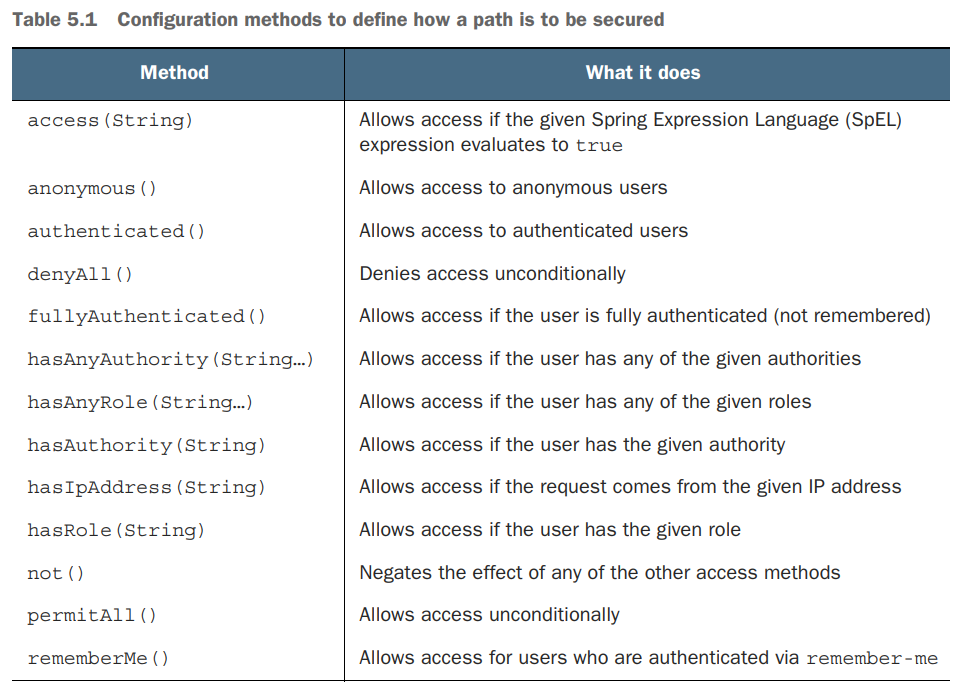

# Getting started with Spring
## 核心概念
- 容器 Container spring上下文
- 依赖注入DI
- 自动配置： autowiring：自动为component注入依赖的bean， component scan：自动扫描发现并创建bean
## 创建spring 应用
- spring initializer： spring initializer是一个基于浏览器的web应用，同时提供了rest api，可以创建spring项目
## Spring Tool Suite
- 提供mvn参数
- 选择依赖模块
    - spring boot dev tools
    - thymlleaf
    - spring web
- 工程结构
    - mvnw和mvnw.cmd：Maven wrapper脚本，可以在未安装maven的情况下使用这些脚本对项目进行构建
    - pom.xml
        - Spring Boot starter dependency：spring-boot-starter-thymeleaf， spring-boot-starter-web， spring-boot-starter-test
        - spring-boot-devtools
        - Spring Boot plugin： spring-boot-maven-plugin
            - 提供了一个maven goal，支持使用maven运行application
            - 所以依赖的lib打包时都会被包含在可执行的jar包内
            - 打包时会创建一个manifest文件，指定TacoCloudApplication为main class
    - Application.java： spring boot main class
    - application.properties
    - static：保存静态资源
    - templates：用于页面渲染的template文件
    - ApplicationTests.java
- @SpringBootApplication注解
    - @SpringBootConfiguration：可以在类中创建bean
    - @EnableAutoConfiguration：spring boot会自动创建认为需要的组件
    - @ComponentScan：扫描有@Component, @Controller, @Service注解的类，自动创建实例，并将实例作为组件注册到spring application context中
- main 方法
    - SpringApplication.run的方法有两个参数：第一个参数为configuration class，该类中可以包含一些以@Bean作为annotataion的创建bean的方法，启动时会将这些bean载入，第二个参数为命令行参数
    - configuration class可以为当前的bootstrap class，也可以为其他类，一般典型的用法是传入当前的当前的bootstrap class
- 启动
    -  ./mvnw package, java -jar target/taco-cloud-0.0.1-SNAPSHOT.jar
    -  ./mvnw spring-boot:run
- 测试
    -  ./mvnw test

## 处理web请求
- Spring MVC是spring的强大的webframework，它的核心是controller，controller用于处理request和response
- @GetMapping注解返回的是view的名字
- view的template的路径默认以/templates为开头，以.html为结尾
-  @{…}表示context-relative，相对路径
-  @WebMvcTest

## Spring Boot DevTools
- 代码更新时自动重启应用
    - DevTools启用时，应用加载时使用了两个class loader，一个用于加载应用代码，一个用于加载依赖包的代码
    - 应用代码更新时，DevTools会reload加载应用代码的class loader，并重启应用，这样可以使重启更快
    - 但是当依赖包发生变化时，必须手动重启
- 自动禁用template缓存
    - 仍需要手动刷新浏览器获取最新内容
- 静态资源变化时自动刷新浏览器
    - 启用了 LiveReload server，如果浏览器安装了 LiveReload server插件，则无需手动刷新浏览器，插件会进行自动刷新
    - https://chrome.google.com/webstore/detail/live-reload/jcejoncdonagmfohjcdgohnmecaipidc?hl=en-US
- 使用H2数据库时，内置H2控制台
    - http://localhost:8080/h2-console

## spring auto configuration做了什么
- 检测依赖的包，并自动创建需要的bean
- 创建Spring MVC需要的bean
- 创建Thymeleaf view resolver用于将Thymeleaf templates渲染为Spring MVC views
- 配置内建的tomcat server

## spring的核心framework
- spring boot
- spring data
- spring security
- Spring Integration and Spring Batch
- Spring Cloud

# Developing web applications
## @SessionAttributes
- 这个注解只能标注在类上，用于在多个请求之间传递参数，类似于Session的Attribute。但不完全一样：一般来说@SessionAttributes设置的参数只用于暂时的传递，而不是长期的保存，长期保存的数据还是要放到Session中
- 当用@SessionAttributes标注的Controller向其模型Model添加属性时，将根据该注解指定的名称/类型检查这些属性，若匹配上了就顺带也会放进Session里。匹配上的将一直放在Sesson中，直到你调用了SessionStatus.setComplete()方法就消失了
- SessionAttributesHandler, 见名之意，它是@SessionAttributes处理器，也就是解析这个注解的核心。管理通过@SessionAttributes标注了的特定会话属性，存储最终是委托了SessionAttributeStore来实现
- RequestMappingHandlerAdapter中getModelFactory时会为每个controller创建一个SessionAttributesHandler
- ModelFactory
    - Spring MVC对@SessionAttributes的处理操作入口，是在ModelFactory.initModel()方法里会对@SessionAttributes的注解进行解析、处理，然后方法完成之后也会对它进行属性同步。
    - ModelFactory是用来维护Model的，具体包含两个功能：
        - 处理器执行前，初始化Model
        - 处理器执行后，将Model中相应的参数同步更新到SessionAttributes中（不是全量，而是符合条件的那些）
    - ModelFactory协助在控制器方法调用之前初始化Model模型，并在调用之后对其进行更新。
        - 初始化时，通过调用方法上标注有@ModelAttribute的方法，使用临时存储在会话中的属性填充模型。
        - 在更新时，模型属性与会话同步，如果缺少，还将添加BindingResult属性。

## @ModelAttribute
- 将方法参数/方法返回值绑定到web view的Model里面。只支持@RequestMapping这种类型的控制器。它既可以标注在方法入参上，也可以标注在方法（返回值）上
    - ModelAttributeMethodProcessor implements HandlerMethodArgumentResolver, HandlerMethodReturnValueHandler
    - 从命名上看它是个Processor，所以根据经验它既能处理入参，也能处理方法的返回值：HandlerMethodArgumentResolver + HandlerMethodReturnValueHandler。解析@ModelAttribute注解标注的方法参数，并处理@ModelAttribute标注的方法返回值。
- @ModelAttribute标注在单独的方法上（木有@RequestMapping注解），它可以在每个控制器方法调用之前，创建出一个ModelFactory从而管理Model数据
    - RequestMappingHandlerAdapter：每次请求过来它都会创建一个ModelFactory，从而收集到全局的（来自@ControllerAdvice）+ 本Controller控制器上的所有的标注有@ModelAttribute注解的方法们
    - ModelFactory.invokeModelAttributeMethods：执行RequestMappingHandlerAdapter找到的所有的标注有@ModelAttribute注解的方法，并且是顺序执行 
- @ModelAttribute这个注解的作用，主要分为如下三个方面：
    - 绑定请求参数到命令对象（入参对象）：放在控制器方法的入参上时，用于将多个请求参数绑定到一个命令对象，从而简化绑定流程，而且自动暴露为模型数据用于视图页面展示时使用；
    - 暴露表单引用对象为模型数据：放在处理器的一般方法（非功能处理方法，也就是没有@RequestMapping标注的方法）上时，是为表单准备要展示的表单引用数据对象：如注册时需要选择的所在城市等静态信息。它在执行功能处理方法（@RequestMapping 注解的方法）之前，自动添加到模型对象中，用于视图页面展示时使用；
    - 暴露@RequestMapping方法返回值为模型数据：放在功能处理方法的返回值上时，是暴露功能处理方法的返回值为模型数据，用于视图页面展示时使用。

## spring-boot-starter-validation
- pom添加依赖
```
<dependency>
        <groupId>org.springframework.boot</groupId>
        <artifactId>spring-boot-starter-validation</artifactId>
</dependency>
```
- data model添加验证注解
```
package com.example.tacos.model;

import java.util.ArrayList;
import java.util.List;

import org.hibernate.validator.constraints.CreditCardNumber;

import jakarta.validation.constraints.Digits;
import jakarta.validation.constraints.NotBlank;
import jakarta.validation.constraints.Pattern;
import lombok.Data;

@Data
public class TacoOrder {
    @NotBlank(message = "Delivery name is required")
    private String deliveryName;
    @NotBlank(message = "Street is required")
    private String deliveryStreet;
    @NotBlank(message = "City is required")
    private String deliveryCity;
    @NotBlank(message = "State is required")
    private String deliveryState;
    @NotBlank(message = "Zip code is required")
    private String deliveryZip;
    @CreditCardNumber(message = "Not a valid credit card number")
    private String ccNumber;
    @Pattern(regexp = "^(0[1-9]|1[0-2])([\\/])([2-9][0-9])$", message = "Must be formatted MM/YY")
    private String ccExpiration;
    @Digits(integer = 3, fraction = 0, message = "Invalid CVV")
    private String ccCVV;
    private List<Taco> tacos = new ArrayList<>();

    public void addTaco(Taco taco) {
        this.tacos.add(taco);
    }
}
```
- html添加error message
```
<!DOCTYPE html>
<html xmlns="http:/ /www.w3.org/1999/xhtml" xmlns:th="http:/ /www.thymeleaf.org">

<head>
    <title>Taco Cloud</title>
    <link rel="stylesheet" th:href="@{/styles.css}" />
</head>

<body>
    <form method="POST" th:action="@{/orders}" th:object="${tacoOrder}">
        <h1>Order your taco creations!</h1>
        
        <h3>Your tacos in this order:</h3>
        <a th:href="@{/design}" id="another">Design another taco</a><br />
        <ul>
            <li th:each="taco : ${tacoOrder.tacos}">
                <span th:text="${taco.name}">taco name</span>
            </li>
        </ul>
        <h3>Deliver my taco masterpieces to...</h3>
        <label for="deliveryName">Name: </label>
        <input type="text" th:field="*{deliveryName}" />
        <span class="validationError" th:if="${#fields.hasErrors('deliveryName')}" th:errors="*{deliveryName}">Error</span>
        <br />
        <label for="deliveryStreet">Street address: </label>
        <input type="text" th:field="*{deliveryStreet}" />
        <span class="validationError" th:if="${#fields.hasErrors('deliveryStreet')}" th:errors="*{deliveryStreet}">Error</span>
        <br />
        <label for="deliveryCity">City: </label>
        <input type="text" th:field="*{deliveryCity}" />
        <span class="validationError" th:if="${#fields.hasErrors('deliveryCity')}" th:errors="*{deliveryCity}">Error</span>
        <br />
        <label for="deliveryState">State: </label>
        <input type="text" th:field="*{deliveryState}" />
        <span class="validationError" th:if="${#fields.hasErrors('deliveryState')}" th:errors="*{deliveryState}">Error</span>
        <br />
        <label for="deliveryZip">Zip code: </label>
        <input type="text" th:field="*{deliveryZip}" />
        <span class="validationError" th:if="${#fields.hasErrors('deliveryZip')}" th:errors="*{deliveryZip}">Error</span>
        <br />
        <h3>Here's how I'll pay...</h3>
        <label for="ccNumber">Credit Card #: </label>
        <input type="text" th:field="*{ccNumber}" />
        <span class="validationError" th:if="${#fields.hasErrors('ccNumber')}" th:errors="*{ccNumber}">Error</span>
        <br />
        <label for="ccExpiration">Expiration: </label>
        <input type="text" th:field="*{ccExpiration}" />
        <span class="validationError" th:if="${#fields.hasErrors('ccExpiration')}" th:errors="*{ccExpiration}">Error</span>
        <br />
        <label for="ccCVV">CVV: </label>
        <input type="text" th:field="*{ccCVV}" />
        <span class="validationError" th:if="${#fields.hasErrors('ccCVV')}" th:errors="*{ccCVV}">Error</span>
        <br />
        <input type="submit" value="Submit Order" />
    </form>
</body>

</html>
```

## WebMvcConfigurer
如果一个controller足够简单，不需要model，不需要处理input，只是返回一个view，则可以使用WebMvcConfigurer来代替
```
import org.springframework.context.annotation.Configuration;
import org.springframework.web.servlet.config.annotation.ViewControllerRegistry;
import org.springframework.web.servlet.config.annotation.WebMvcConfigurer;

@Configuration
public class WebConfig implements WebMvcConfigurer {
	@Override
	public void addViewControllers(ViewControllerRegistry registry) {
		registry.addViewController("/").setViewName("home");
	}
}
```

# Working with data
## h2 console
- http://localhost:8080/h2-console
- jdbc:h2:mem:tacocloud
## jdbc
- 当只有一个构造器方法时，Spring自动通过该构造函数的参数装配依赖项
- 如果有多个构造器方法，想要使用哪个方法装配依赖项，则需要在对应的构造器方法上加@Autowired

## schema.sql, data.sql
- 如果在根目录下有一个schema.sql文件，则在spring boot项目启动时会执行这个文件的sql
- 如果在根目录下有一个data.sql文件，则在spring boot项目启动时会执行这个文件的sql

## Reading and writing data with JDBC
- spring-boot-starter-jdbc
- org.springframework.jdbc.core.JdbcTemplate
- 需要自己实现dao层与数据库交互的代码，代码中只需关心sql语句，无需关心sql连接的建立和释放

## Working with Spring Data JDBC
- spring-boot-starter-data-jdbc
- org.springframework.data.repository.Repository
- org.springframework.data.repository.CrudRepository
- 无需实现dao层代码，只需要定义接口，接口extend Repository或者CrudRepository， spring data jdbc会自动生成代码实现
- 注解
    - org.springframework.data.relational.core.mapping.Table
    - org.springframework.data.annotation.Id;
    - org.springframework.data.relational.core.mapping.Column

## Persisting data with Spring Data JPA
- spring-boot-starter-data-jpa
- org.springframework.data.repository.Repository
- org.springframework.data.repository.CrudRepository
- 无需实现dao层代码，只需要定义接口，接口extend Repository或者CrudRepository， spring data jdbc会自动生成代码实现
- 注解
    - jakarta.persistence.Entity;
    - jakarta.persistence.GeneratedValue;
    - jakarta.persistence.GenerationType;
    - jakarta.persistence.Id;
    - jakarta.persistence.ManyToMany
    - jakarta.persistence.OneToMany
- 配置
    - spring.jpa.generate-ddl：Whether to initialize the schema on startup
    - spring.jpa.hibernate.ddl-auto：DDL mode. This is actually a shortcut for the "hibernate.hbm2ddl.auto" property. Defaults to "create-drop" when using an embedded database and no schema manager was detected. Otherwise, defaults to "none".


# Working with nonrelational data
## Working with Cassandra repositories
- spring-boot-starter-data-cassandra
- 注解
    - org.springframework.data.cassandra.core.mapping.PrimaryKey;
    - org.springframework.data.cassandra.core.mapping.Table;
    - org.springframework.data.cassandra.core.cql.Ordering;
    - org.springframework.data.cassandra.core.cql.PrimaryKeyType;
    - org.springframework.data.cassandra.core.mapping.Column;
    - org.springframework.data.cassandra.core.mapping.UserDefinedType
## Writing MongoDB repositories
- spring-boot-starter-data-mongodb
-  注解
    - org.springframework.data.annotation.Id;
    - org.springframework.data.mongodb.core.mapping.Document;

# Securing Spring
## Enabling Spring Security
- pom中添加spring-boot-starter-security依赖
- spring-boot-starter-security提供了一个默认的登录页面，默认username为：user，每次项目启动时会生成一个随机的uuid作为密码
    - Using generated security password: 2b94e0bd-0380-4293-842d-7d3dffca0c8c
- UsernamePasswordAuthenticationFilter会对请求进行验证，验证通过之后会生成一个sessionId，写入cookie中

## password encoder
- BCryptPasswordEncoder—Applies bcrypt strong hashing encryption
- NoOpPasswordEncoder—Applies no encoding
- Pbkdf2PasswordEncoder—Applies PBKDF2 encryption
- SCryptPasswordEncoder—Applies Scrypt hashing encryption
- StandardPasswordEncoder—Applies SHA-256 hashing encryption
- 数据库中存储的password是encode之后的，数据库的password永远不会被decode，需要验证时会将用户输入的密码进行encode之后与数据库存储的进行比较。由PasswordEncoder的matches() 方法实现

## 配置user store
- 需要声明一个UserDetailsService类型的bean
- Spring Security提供了几种UserDetailsService的实现
    - An in-memory user store
    - A JDBC user store
    - An LDAP user store

### in-memory user store

```
    @Bean
	public UserDetailsService userDetailsService(PasswordEncoder encoder) {
		List<UserDetails> usersList = new ArrayList<>();
		usersList.add(
				new User("buzz", encoder.encode("password"), Arrays.asList(new SimpleGrantedAuthority("ROLE_USER"))));
		usersList.add(
				new User("woody", encoder.encode("password"), Arrays.asList(new SimpleGrantedAuthority("ROLE_USER"))));
		return new InMemoryUserDetailsManager(usersList);
	}
```

###  Customizing user authentication
- Defining a user entity
- Create interface: UserRepository extends CrudRepository<User, Long>, no need to implement, define one methodin interface: User findByUsername(String username);
- Create a UserDetailsService
```
@Bean
public UserDetailsService userDetailsService(UserRepository userRepo) {
 return username -> {
 User user = userRepo.findByUsername(username);
 if (user != null) return user;
 throw new UsernameNotFoundException("User '" + username + "' not found");
 };
}
```
- Create user Registration page

## Securing web requests
- HttpSecurity充当构建器,用于配置如何在 Web 级别处理安全性
- HttpSecurity维护了一个过滤器的列表，这个过滤器的列表最终放入了DefaultSecurityFilterChain这个过滤器链中
- HttpSecurity最终提供了很多的配置，然而所有的配置也都是为了处理维护我们的过滤器列表
- 用于配置某个路径的安全策略

- HttpSecurity方法说明
    - openidLogin()	用于基于 OpenId 的验证
    - headers()	将安全标头添加到响应
    - cors()	配置跨域资源共享（ CORS ）
    - sessionManagement()	允许配置会话管理
    - portMapper()	允许配置一个PortMapper(HttpSecurity#(getSharedObject(class)))，其他提供SecurityConfigurer的对象使用 PortMapper 从 HTTP 重定向到 HTTPS 或者从 HTTPS 重定向到 HTTP。默认情况下，Spring Security使用一个PortMapperImpl映射 HTTP 端口8080到 HTTPS 端口8443，HTTP 端口80到 HTTPS 端口443
    - jee()	配置基于容器的预认证。 在这种情况下，认证由Servlet容器管理
    - x509()	配置基于x509的认证
    - rememberMe	允许配置“记住我”的验证
    - authorizeRequests()	允许基于使用HttpServletRequest限制访问
    - requestCache()	允许配置请求缓存
    - exceptionHandling()	允许配置错误处理
    - securityContext()	在HttpServletRequests之间的SecurityContextHolder上设置SecurityContext的管理。 当使用WebSecurityConfigurerAdapter时，这将自动应用
    - servletApi()	将HttpServletRequest方法与在其上找到的值集成到SecurityContext中。 当使用WebSecurityConfigurerAdapter时，这将自动应用
    - csrf()	添加 CSRF 支持，使用WebSecurityConfigurerAdapter时，默认启用
    - logout()	添加退出登录支持。当使用WebSecurityConfigurerAdapter时，这将自动应用。默认情况是，访问URL”/ logout”，使HTTP Session无效来清除用户，清除已配置的任何#rememberMe()身份验证，清除SecurityContextHolder，然后重定向到”/login?success”
    - anonymous()	允许配置匿名用户的表示方法。 当与WebSecurityConfigurerAdapter结合使用时，这将自动应用。 默认情况下，匿名用户将使用org.springframework.security.authentication.AnonymousAuthenticationToken表示，并包含角色 “ROLE_ANONYMOUS”
    - formLogin()	指定支持基于表单的身份验证。如果未指定FormLoginConfigurer#loginPage(String)，则将生成默认登录页面
    - oauth2Login()	根据外部OAuth 2.0或OpenID Connect 1.0提供程序配置身份验证
    - requiresChannel()	配置通道安全。为了使该配置有用，必须提供至少一个到所需信道的映射
    - httpBasic()	配置 Http Basic 验证
    - addFilterAt()	在指定的Filter类的位置添加过滤器
- 使用
    - authorizeHttpRequests 用于配置每个路径需要使用什么安全策略
    - headers, 将安全标头添加到响应， 由于h2-console是以iframe的形式嵌入在页面上的，所以这里必须配置frameOptions，headers.frameOptions().sameOrigin() 和headers.frameOptions().disable()都可以，否则的话h2-console将无法正常显示
    - formLogin： 用于配置登录页面，这里不作额外配置就是使用默认登录页面，如果不加formLogin，将不会使用任何登录页面，默认登录页面也没有
```
	@Bean
	SecurityFilterChain filterChain(HttpSecurity http) throws Exception {
		return http
				.authorizeHttpRequests(auth -> auth.requestMatchers(AntPathRequestMatcher.antMatcher("/h2-console/**"))
						.permitAll().requestMatchers("/design", "/orders").hasRole("USER").requestMatchers("/", "/**")
						.permitAll())
				.headers(headers -> headers.frameOptions().sameOrigin())
				.csrf(csrf -> csrf.ignoringRequestMatchers(AntPathRequestMatcher.antMatcher("/h2-console/**")))
				.formLogin().and().build();
	}
```
## Creating a custom login page
